### VERSION 1.6 – JULI 2020

* [Einführung](#intro)
* [Regeln](#rules)
* [Glossar](#glossary)
* [Errata](#errata)
* [FAQ](#faq)
* [Link zum Regel-PDF](https://asmodee-resources.azureedge.net/media/germanyprod/Produkte/Keyforge/Download/KeyForge_Referenzhandbuch_DE_v1-7.pdf)
* [Deck rating](/awp.html)

# Introduction

## WILLKOMMEN IM SCHMELZTIEGEL…

_Du bist ein Archont. Einige verehren dich als Gott, andere bewundern dich
für deine Weisheit. Geboren – vielleicht auch erschaffen – wurdest du im
Schmelztiegel, einer Welt, in der das Unmögliche möglich ist._

Der Schmelztiegel ist uralt und doch ewig jung, ein künstlicher Planet im
Zentrum des Universums. Unablässig arbeiten die rätselhaften und tückischen
Architekten an den zahlreichen Ebenen des Schmelztiegels. Um an genügend
Rohstoffe zu gelangen, haben sie viele Welten geplündert und daraus einen
neuen Planeten geformt, der seinen Bewohnern gleichermaßen vertraut und
fremdartig erscheint.

Egal ob es sich um einzelne Exemplare oder ganze Spezies handelt, jedes
Wesen, das in den Schmelztiegel gebracht wird, gelangt in ein bizarres
Wunderland, aus dem es keinen offensichtlichen Ausweg gibt. Manche
blühen auf, errichten neue Zivilisationen und entwickeln Technologien, die auf
einer mysteriösen, übernatürlichen Substanz namens Æmber beruhen. Einige
lassen ihr altes Leben hinter sich und passen sich den Gepfl ogenheiten und
Bräuchen der heimischen Völker ihrer neuen Welt an. Andere degenerieren
körperlich und geistig bis zur Unkenntlichkeit und verschmelzen schließlich ihr
Fleisch mit dem Æmber.

Als Archont hast auf deinen Reisen durch den Schmelztiegel zahlreiche
Jünger um dich geschart, die deine zeitlose Weisheit und deine Fähigkeit zur
Kommunikation mit allen Lebewesen bewundern. Mit ihrer Hilfe suchst du
nach Schatzkammern, geheimen Orten, die von den mysteriösen Architekten
im ganzen Schmelztiegel versteckt wurden. Für jede Schatzkammer werden
Schlüssel benötigt, die aus Æmber geschmiedet sind. Einmal geöffnet, kann
der Inhalt einer Schatzkammer – die Macht und das Wissen der Architekten –
nur von einem einzigen Archonten absorbiert werden.

Wird eine Schatzkammer von mehreren Archonten entdeckt, kann nur
einer von ihnen ihr Wissen in sich aufnehmen und so dem Geheimnis des
Schmelztiegels einen Schritt näher kommen …

### SPIELBESCHREIBUNG

KeyForge ist ein Kartenspiel für 2 Spieler, die in die Rollen von Archonten
schlüpfen und sich mit deren Decks ein Duell liefern.

Jedes Deck stellt ein Team dar, das sich auf die Suche nach Æmber begibt,
um Schlüssel daraus zu schmieden. Wer als Erster drei Schlüssel erschaffen
hat, öffnet die Schatzkammer und gewinnt das Spiel.

Das Besondere an KeyForge ist, dass es keine 2 identischen Decks gibt.
Es ist kein Sammelkartenspiel – ihr baut eure Decks nicht selbst. Jedes Deck
ist komplett und unveränderlich. Jedes Deck ist weltweit einmalig!

## VERWENDUNG DIESES DOKUMENTS

Wenn ihr KeyForge noch nicht gespielt habt, wird empfohlen zuerst
die Schnellstartregeln aus dem Starter-Set zu verwenden, um damit die
Grundlagen des Spiels zu lernen.

Nach dem ersten Spiel mit den Schnellstartregeln können die Spieler die
vollständigen Regeln in diesem Dokument nachlesen und sich über die Welt
von KeyForge informieren.

Zusätzlich bietet dieses Dokument noch ein Glossar, in dem wichtige
Spielkonzepte und Spielbegriffe erklärt werden, um Kartenfähigkeiten besser
interpretieren zu können.

# SPIELREGELN

## GRUNDLEGENDE KONZEPTE

In diesem Abschnitt werden die grundlegenden Konzepte des Spiels
beschrieben, welche die Spieler beim Spielen im Hinterkopf haben sollten.

### DIE GOLDENE REGEL

Falls der Text einer Karte im direkten Widerspruch zu den Regeln steht,
hat der Text der Karte stets Vorrang.

### ZIEL DES SPIELS

Während des Spiels verwenden die Spieler ihre Karten, um Æmber zu
sammeln. Mit Æmber schmieden die Spieler Schlüssel. Sobald ein Spieler
seinen 3. Schlüssel geschmiedet hat, endet das Spiel sofort und er
hat gewonnen.

### SPIELBEREIT UND ERSCHÖPFT

Karten im Spiel können 1 von 2 Zuständen haben.

**Spielbereite** Karten sind aufrecht orientiert, sodass ihr Text von links nach
rechts lesbar ist. Ein spielbereite Karte kann im Zug eines Spielers verwendet
werden, wodurch sie erschöpft wird.

**Erschöpfte** Karten sind um 90 Grad gedreht und zur Seite orientiert. Eine
erschöpfte Karte kann nicht verwendet werden, bis sie durch einen Spielschritt
oder eine Kartenfähigkeit wieder spielbereit gemacht worden ist.

**Alle Kreaturen und Artefakte kommen erschöpft ins Spiel.**

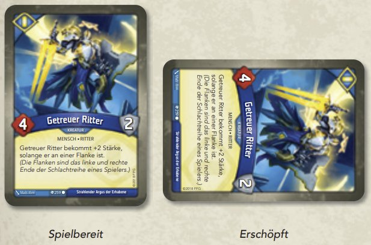

### KEINE MARKER ODER STATUSKARTEN MEHR ÜBRIG

Die Anzahl der Schadens- und Æmbermarker und Statuskarten, die gleichzeitig
im Spielbereich sein können, ist nicht begrenzt. Falls die mitgelieferten
Marker oder Statuskarten knapp werden sollten, dürfen andere Marker, Zähler 
oder Münzen verwendet werden, um den aktuellen Spielstatus festzuhalten.

## AUFBAU
Beim Spielaufbau werden folgende Schritte in der angegebenen
Reihenfolge durchgeführt:

1. Legt alle Æmbermarker, Schadensmarker und Statuskarten für beide
Spieler griffbereit in eine gemeinsame Reserve.
2. Jeder Spieler legt seine Avatarkarte links oder rechts neben
seinen Spielbereich.
3. Jeder Spieler legt 3 Schlüsselmarker (von jeder Farbe einen) mit der
ungeschmiedeten Seite nach oben neben seine Avatarkarte.
4. Bestimmt einen Startspieler nach dem Zufallsprinzip. Dieser Spieler ist bei
Spielbeginn mit seinem Zug zuerst an der Reihe. (Falls die Spieler mit den
gleichen Decks mehrere Spiele hintereinander spielen, entscheidet ab
dem 2. Spiel der Spieler, dessen Deck im Spiel zuvor besiegt worden ist,
wer der Startspieler ist.)
5. Jeder Spieler mischt sein Deck und bietet es seinem Gegner zum
erneuten Mischen und/oder Abheben an.
6. Der Startspieler zieht **7 Karten auf seine Starthand**, während der andere
Spieler **6 Karten auf seine Starthand** zieht.
7. Beginnend mit dem Startspieler hat jeder Spieler 1 Mal die Gelegenheit,
einen **Mulligan** zu nehmen, indem er alle Karten in sein Deck zurückmischt und eine neue Starthand zieht, die aus 1 Karte weniger besteht.
(Dieser Schritt wird in den Schnellstartregeln übersprungen.)

Jetzt kann das Spiel beginnen.

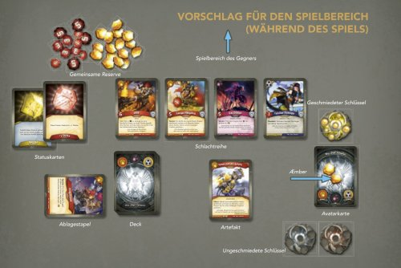

## ZUGÜBERSICHT
Das Spiel wird über eine Reihe von Zügen gespielt. Die Spieler wechseln sich
dabei so lange ab, bis 1 Spieler gewonnen hat.

Jeder Zug besteht aus 5 Schritten:

1. Schlüssel schmieden
2. Fraktion wählen
3. Karten der gewählten Fraktion spielen, ablegen oder verwenden
4. Karten spielbereit machen
5. Karten ziehen

Der Spieler, der gerade am Zug ist, wird **aktiver Spieler** genannt.
Der aktive Spieler ist der einzige Spieler, der Aktionen durchführen
kann oder Entscheidungen trifft; der Spieler, der nicht am Zug ist,
trifft keine Entscheidungen.

Jeder Schritt wird in den folgenden Abschnitten genauer erklärt.

###  SCHRITT 1: SCHLÜSSEL SCHMIEDEN

Falls der aktive Spieler in diesem Schritt genug Æmber hat, um einen
Schlüssel zu schmieden, muss er dies tun. Um einen Schlüssel zu schmieden,
gibt der aktive Spieler Æmber aus seinem Æmber-Vorrat auf seiner
Avatarkarte aus und legt es in die gemeinsame Reserve zurück. Dann dreht er
1 seiner Schlüsselmarker auf seine geschmiedete Seite, um anzuzeigen, dass
der Schlüssel geschmiedet worden ist.

* **Die Standardkosten, um einen Schlüssel zu schmieden, sind 6 Æmber.**
Kartenfähigkeiten können diese Zahl erhöhen oder senken.
* Pro Zug kann in diesem Schritt maximal 1 Schlüssel geschmiedet werden,
auch wenn der aktive Spieler genug Æmber hat, um mehrere Schlüssel
zu schmieden.
* Einige Karten haben Effekte, die es erlauben, Æmber auf diesen Karten
beim Schmieden von Schlüsseln auszugeben. Falls der aktive Spieler in
Schritt 1 genug Æmber in seinem Æmber-Vorrat und auf Karten unter
seiner Kontrolle mit diesem Effekt hat, um einen Schlüssel zu schmieden,
muss er dies tun.

### SCHRITT 2: FRAKTION WÄHLEN

Jedes KeyForge-Deck ist aus 3 Fraktionen zusammengesetzt, die auf der
Avatarkarte abgebildet sind. In diesem Schritt wählt der aktive Spieler
1 dieser 3 Fraktionen auf seiner Avatarkarte und aktiviert sie. Dadurch wird
die gewählte Fraktion für den Rest des Zuges zur **aktiven Fraktion**. Die aktive
Fraktion legt fest, welche Karten der aktive Spieler in diesem Zug spielen, von
seiner Hand ablegen und verwenden kann.

* Nachdem der aktive Spieler eine Fraktion gewählt hat, hat er die
Möglichkeit, alle Karten aus seinem Archiv zu nehmen und sie seiner
Hand hinzuzufügen. (Siehe [„Archiv“](#archiv) im Glossar.)
* Falls ein Spieler eine Karte kontrolliert, die nicht zu 1 der 3 Fraktionen
auf seiner Avatarkarte gehört, darf er (falls er möchte) in diesem Schritt
anstatt 1 der 3 Fraktionen in seinem Deck auch jene Fraktion wählen
und aktivieren.
* Ein Spieler kann eine Fraktion nicht wählen und aktivieren, es sei denn, sie
befindet sich auf seiner Avatarkarte oder er kontrolliert eine Karte, die zu
dieser Fraktion gehört. Falls ein Karteneffekt einen Spieler dazu anweist,
eine Fraktion zu wählen, die nicht zu den oben aufgeführten Kategorien
gehört, wird der Karteneffekt ignoriert (siehe Glossareintrag [„Kann nicht
vs. muss/darf, Kann nicht vs. ‚Erlauben‘-Effekt“](#kannnicht)).

### SCHRITT 3: KARTEN DER GEWÄHLTEN FRAKTION SPIELEN, ABLEGEN UND VERWENDEN

Der aktive Spieler darf in diesem Schritt beliebig viele Karten der aktiven
Fraktion spielen und von der Hand ablegen und er darf beliebig viele Karten
der aktiven Fraktion verwenden, die er im Spiel kontrolliert. Infrage 
kommende Karten dürfen in beliebiger Reihenfolge gespielt, verwendet 
und/oder abgelegt werden.

Die Fraktion einer Karte wird durch das Symbol in der
linken oberen Ecke festgelegt. Falls die aktive Fraktion
mit dem Symbol der Karte übereinstimmt, kommt
die Karte infrage, gespielt, verwendet oder abgelegt
zu werden.

Die Regeln, wie Karten gespielt, abgelegt und
verwendet werden, werden später beschrieben.

* **Regel für den ersten Zug**: Im ersten Zug des Startspielers kann
dieser nicht mehr als 1 Karte von seiner Hand spielen oder ablegen.
Karteneffekte können diese Regel verändern.
* Der aktive Spieler darf keine Karten spielen, verwenden oder ablegen,
die nicht von der aktiven Fraktion sind, es sei denn, eine Kartenfähigkeit
besagt etwas anderes.

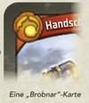

Rules for playing, discarding, and using cards are described later.

* **First Turn Rule:** During the first player’s first turn of the game, that player cannot play or discard more than one card from their hand. Card effects can modify this rule.
* The active player may not play, use, or discard cards that aren't of the active house unless specified by a card ability

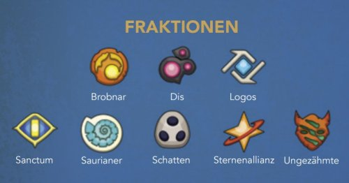

### SCHRITT 4: KARTEN SPIELBEREIT MACHEN

Der aktive Spieler macht alle seine erschöpften Karten spielbereit.

### SCHRITT 5: KARTEN ZIEHEN
Der aktive Spieler zieht in diesem Schritt von seinem Deck bis auf
6 Handkarten auf. Nachdem ein Spieler diesen Schritt abgeschlossen hat,
endet sein Zug.

* Falls der aktive Spieler mehr als 6 Karten auf seiner Hand hat,
legt er nicht auf 6 Handkarten ab.
* Falls ein Spieler (in diesem Schritt oder in einem beliebigen anderen)
Karten ziehen muss und dies nicht kann, weil sein Deck leer ist, mischt der
Spieler seinen Ablagestapel zu einem neuen Deck und zieht dann weiter
(die Karten werden eine nach der anderen gezogen).
* Falls der aktive Spieler genügend Æmber zum Schmieden eines
Schlüssels in seinem Vorrat hat, sobald der Zug des Spielers endet,
ruft er „Check!“, damit der Gegner weiß, dass der aktive Spieler zu
Beginn seines nächsten Zuges einen Schlüssel schmieden kann.

## KARTEN SPIELEN

Dem aktiven Spieler ist es in Schritt 3 seines Zuges erlaubt, eine beliebige
Anzahl Karten zu spielen, die zur aktiven Fraktion gehören.

#### ÆMBER BONUS
Viele Karten im Spiel haben einen Æmber-Bonus oben links unter dem
Fraktionssymbol. Sobald eine Karte mit einem Æmber-Bonus gespielt wird,
erhält der aktive Spieler als Allererstes die entsprechende Menge an Æmber.
Immer wenn ein Spieler Æmber erhält (egal warum), legt er es in seinen
Æmber-Vorrat (auf seine Avatarkarte).

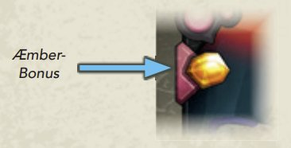

#### „SPIELEN“-FÄHIGKEITEN

Manche Karten haben eine fett gedruckte **„Spielen:“**-Fähigkeit. Diese wird
abgehandelt, nachdem man den Æmber-Bonus der Karte (falls vorhanden)
erhalten hat, unmittelbar nachdem die Karte ins Spiel gekommen ist.

### KARTENARTEN

Es gibt 4 Arten von Karten im Spiel: Aktionskarten, Artefakte, Kreaturen
und Aufwertungen. Die Regeln für das Spielen einer Karte hängen von ihrer
Art ab.

#### AKTIONSKARTEN

Sobald eine Aktionskarte gespielt wird,
handelt der aktive Spieler die **„Spielen:“**-
Fähigkeit der Karte ab und legt sie, nachdem
er von der Fähigkeit so viel wie möglich
abgehandelt hat, auf seinen Ablagestapel.

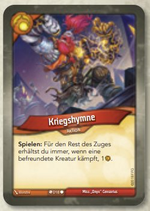

### ARTEFAKTE

Artefakte kommen erschöpft ins Spiel
und werden in eine Reihe hinter die
Schlachtreihe des Spielers gelegt, was auf
der nächsten Seite genauer erklärt wird.
Artefakte bleiben für die kommenden Züge
im Spiel.

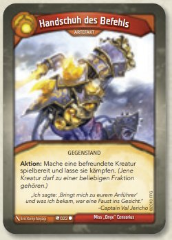

#### KREATUREN

Kreaturen kommen erschöpft ins Spiel und werden in die vorderste Reihe
(die sogenannte Schlachtreihe) in den Spielbereich des aktiven Spielers
gelegt. Kreaturen bleiben für die kommenden Züge im Spiel. Sie haben einen
Stärke- und einen Rüstungswert. Beide Werte werden verwendet um Kämpfe
abzuhandeln, die später erklärt werden.

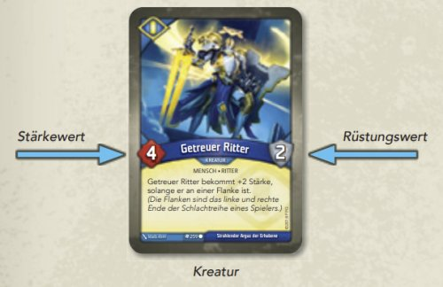

Immer wenn eine Kreatur ins Spiel kommt, muss sie an eine Flanke gelegt
werden – also an das linke oder rechte Ende der Schlachtreihe ihres
kontrollierenden Spielers. Immer wenn eine Kreatur das Spiel verlässt, wird
die Lücke in der Schlachtreihe geschlossen, indem die Karten nach innen
geschoben werden.

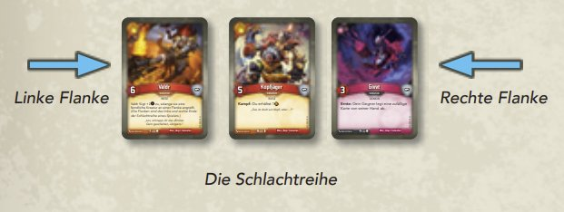

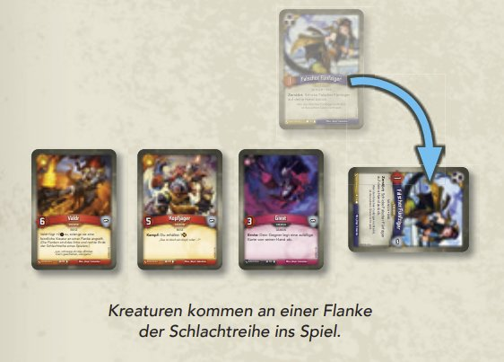

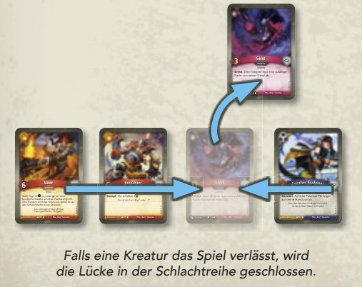

#### AUFWERTUNGEN
Aufwertungen kommen an eine Kreatur angelegt ins Spiel (d. h. sie werden
leicht überlappend unter eine Kreatur geschoben), die der Spieler, der die
Aufwertung kontrolliert, gewählt hat. Aufwertung bleiben für die kommenden
Züge im Spiel und modifizieren die Karten, an die sie angelegt sind.

* Falls eine Karte mit einer angelegten Aufwertung das Spiel verlässt, wird
die Aufwertung abgelegt.
* Falls eine Aufwertung nicht an eine Karte im Spiel angelegt werden kann,
kann die Aufwertung nicht ins Spiel kommen.

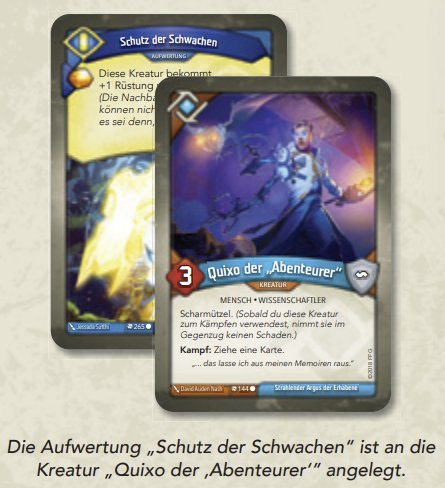

### KARTEN ABLEGEN

Der aktive Spieler kann in Schritt 3 seines Zuges beliebig viele Karten
der aktiven Fraktion von seiner Hand ablegen. Karten werden zu einem
beliebigen Zeitpunkt in diesem Schritt eine nach der anderen abgelegt.
Auf diese Weise wird der Spieler unerwünschte Karten los und schafft
Platz für neue Karten, die er am Ende des Zuges nachziehen kann.

### KARTEN VERWENDEN

Der aktive Spieler kann in Schritt 3 seines Zuges beliebig viele Karten der
aktiven Fraktion, die er im Spiel hat, verwenden. Abhängig von der Kartenart
hat der aktive Spieler verschiedene Möglichkeiten, wie er eine Karte
verwenden kann.

#### AUFWERTUNGEN

Eine Aufwertung modifiziert die Kreatur, an die sie angelegt ist, und kann
nicht unabhängig von dieser Kreatur verwendet werden.

#### ARTEFAKTE VERWENDEN
Es gibt 2 Arten von Fähigkeiten, die ein Spieler auf einem Artefakt verwenden
kann: **„Aktion:“**- und **„Universell:“**-Fähigkeiten.

* Sobald ein Spieler ein Artefakt verwendet, erschöpft er die Karte und
handelt dann seine Fähigkeit ab.
* Ein Spieler kann nur dann eine **„Aktion:“**-Fähigkeit verwenden,
falls sie sich auf einer Karte befindet, die zur aktiven Fraktion gehört.
* Ein Spieler kann eine **„Universell:”**-Fähigkeit auch dann abhandeln,
falls sie sich auf einer Karte befindet, die **nicht** zur aktiven Fraktion gehört.
* Manche Artefakte verlangen, dass sie als Teil der Kosten, um sie zu
verwenden, geopfert werden müssen. Sobald ein Artefakt geopfert wird,
wird es auf den Ablagestapel seines Besitzers gelegt. Der Spieler muss
ein solches Artefakt noch immer erschöpfen, sobald er es verwendet.
* Artefakte können nicht zum Ernten oder zum Kampf verwendet werden.

#### KREATUREN VERWENDEN

Sobald ein Spieler eine Kreatur verwendet, muss er die Kreatur erschöpfen.
Der Spieler hat nun die Möglichkeit mit der Kreatur zu ernten, zu kämpfen,
ihre **„Aktion:“**-Fähigkeit auszulösen oder ihre **„Universell:“**-Fähigkeit
auszulösen. Jeder Karteneffekt, der eine Kreatur dazu bringt, zu kämpfen,
zu ernten, ihre **„Aktion:“**-Fähigkeit auszulösen oder ihre **„Universell:“**-
Fähigkeit auszulösen, bewirkt, dass diese Kreatur verwendet wird.

##### ERNTE

**Jede spielbereite Kreatur der aktiven Fraktion darf ernten.**
Sobald eine Kreatur zum Ernten verwendet wird, wird sie erschöpft
und der Spieler, der sie kontrolliert, erhält 1 Æmber in seinen ÆmberVorrat. Dann werden gegebenenfalls alle **„Ernte:“**-Fähigkeiten der
Kreatur abgehandelt.

##### KAMPF

**Jede spielbereite Kreatur der aktiven Fraktion darf kämpfen.** Sobald
eine Kreatur zum Kämpfen verwendet wird, wird sie erschöpft und der
Spieler, der sie kontrolliert, wählt 1 infrage kommende Kreatur unter der
Kontrolle des Gegners als Ziel des Angriffs. Jede kämpfende Kreatur
fügt der anderen Schaden in Höhe ihrer Stärke (dem Wert links neben
dem Kartentitel) zu. All jener Schaden wird gleichzeitig zugefügt. Nach
dem Abhandeln des Kampfes werden gegebenenfalls alle **„Kampf:“**-
Fähigkeiten der Kreatur abgehandelt, die zum Kämpfen verwendet
worden ist, falls sie den Kampf überlebt hat.

Eine Kreatur kann nicht kämpfen, falls es keine feindliche Kreatur gibt,
die als Ziel des Angriffs gewählt werden könnte.

##### AKTION

**Jede spielbereite Kreatur der aktiven Fraktion darf ihre „Aktion:“-
Fähigkeit auslösen, sofern sie eine besitzt.** Sobald eine Kreatur
verwendet wird, um ihre **„Aktion:“**-Fähigkeit auszulösen, wird die Kreatur
erschöpft und die **„Aktion:“**-Fähigkeit abgehandelt.

##### UNIVERSELL

**Jede spielbereite Kreatur mit einer „Universell:“-Fähigkeit kann diese
auslösen**, auch wenn sie **nicht** zur aktiven Fraktion gehört. Sobald eine
Kreatur verwendet wird, um ihre **„Universell:“**-Fähigkeit auszulösen, wird
die Kreatur erschöpft und die **„Universell:“**-Fähigkeit abgehandelt.

#### SCHADEN UND RÜSTUNG

Sobald einer Kreatur Schaden zugefügt wird, legt man entsprechend viele
Schadensmarker auf die Kreatur. Hat eine Kreatur mindestens so viele
Schadensmarker wie Stärke, wird sie zerstört und oben auf den Ablagestapel
ihres Besitzers gelegt. Hat eine Kreatur einen Rüstungswert (rechts neben
dem Kartentitel), verhindert die Rüstung in jedem Zug entsprechend viel
eingehenden Schaden. (Mehr dazu unter „Rüstung“ im Glossar.)

* Sobald eine Kreatur das Spiel verlässt, erhält der Gegner sämtliches
Æmber, das auf der Kreatur liegt. (Siehe [„Erbeuten“](#erbeuten) im Glossar.)

#### KAMPF BEISPIEL

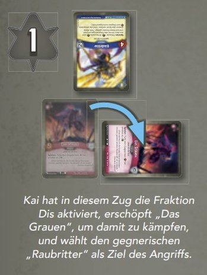

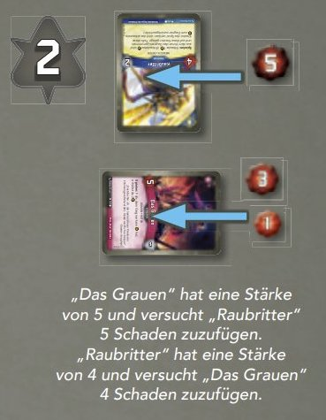

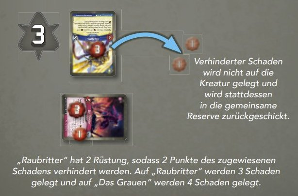

### KARTENFÄHIGKEITEN

Sofern die Fähigkeit nichts anderes angibt, trifft der aktive Spieler alle
Entscheidungen, die mit dem Abhandeln einer Fähigkeit einher gehen.

Mehr zu den speziellen Begriffen, die in den Texten der Kartenfähigkeiten
vorkommen, findet man im Glossar.

#### SO VIEL WIE MÖGLICH ABHANDELN

Beim Abhandeln einer Kartenfähigkeit wird so viel wie möglich von ihr
abgehandelt und die Teile der Fähigkeit, die nicht abgehandelt werden
können, werden ignoriert.

_**Beipiel**: Aaron spielt die Karte Zorn (RdA 001) mit dem Text: „**Spielen:**
Mache eine befreundete Kreatur spielbereit und lasse sie kämpfen.“ und
wählt seinen befreundeten Schnüffelgator (RdA 358), um die Fähigkeit
abzuhandeln. Allerdings ist der Schnüffelgator bereits spielbereit, sodass
Aaron diesen Teil der Fähigkeit ignoriert und einfach seinen befreundeten
Schnüffelgator zum Kämpfen verwendet._

#### FÄHIGKEITEN IN DER REIHENFOLGE ABHANDELN, IN DER SIE IM TEXT AUFTAUCHEN

Beim Abhandeln eines Kartenfähigkeitstexts werden die Anweisungen
stets in der Reihenfolge abgehandelt, in der sie im Text auftauchen.
Ersatzeffekte können dies modifizieren, auch wenn sie erst später im Text der
abgehandelten Fähigkeit auftauchen.

_**Beispiel**: Der Text von Hyde (KW 167) lautet: „**Ernte:** Ziehe 1 Karte.
Falls du Velum kontrollierst, ziehe stattdessen 2 Karten.“ Der zweite Satz
ist ein Ersatzeffekt, der sich auf den ersten Satz auswirkt und dessen
Abhandlung modifiziert._

_**Ausnahme**: Jeglicher Schaden, der durch eine Kartenfähigkeit zugefügt wird,
wird gleichzeitig zugefügt, egal wo er innerhalb des Fähigkeitstexts auftaucht._

_**Beispiel**: Der Text von Lanze der Macht (RdA 221) lautet: „Spielen: Füge
einer Kreatur 3 Schaden zu und füge einem Nachbarn jener Kreatur 3 Schaden zu.“
Dieser Schaden wird beiden Kreaturen gleichzeitig zugefügt, obwohl er
nacheinander im Text der Fähigkeit auftaucht._

#### KARTEN ÜBER ANDERE KARTENFÄHIGKEITEN VERWENDEN
Falls eine Kartenfähigkeit das Spielen oder Verwenden einer anderen Karte
(oder das Kämpfen oder Ernten mit einer Karte) erlaubt, darf die gewählte
Karte zu einer beliebigen Fraktion gehören, es sei denn, die Fähigkeit besagt
ausdrücklich etwas anderes.

* Sobald eine Karte über eine Kartenfähigkeit verwendet wird, müssen
alle anderen Bedingungen für das Verwenden der Karte (z. B. das
Erschöpfen zum Ernten, Kämpfen oder Abhandeln ihrer **„Aktion:“**-
Fähigkeit) trotzdem eingehalten werden. Andernfalls kann die Karte nicht
verwendet werden.
* Man kann nur Karten verwenden, die man selbst kontrolliert, es sei denn,
eine Kartenfähigkeit besagt ausdrücklich etwas anderes.

#### DIE SECHSER-REGEL

Hin und wieder kommt es zu Situationen, in denen eine Karte in einem Zug
durch eine Kombination von Fähigkeiten wiederholt gespielt oder verwendet
werden kann. Ein Spieler kann dieselbe Karte und/oder andere Kopien dieser
Karte (nach Titel) nicht mehr als *6 Mal* pro Zug spielen und/
oder verwenden.

#### KONSTANTE FÄHIGKEITEN

Kartenfähigkeiten, die nicht durch ein fett
gedrucktes Stichwort eingeleitet werden, sind
konstante Fähigkeiten, die so lange aktiv bleiben,
wie die Karte im Spiel ist und alle Bedingungen
erfüllt, die bei der Fähigkeit angegeben sind.

*Konstante Fähigkeit bleiben auch im
erschöpftem Zustand einer Karte aktiv.
* Das Anwenden der Effekte einer konstanten
Fähigkeit gilt nicht als Verwenden der Karte
und führt daher nicht dazu, dass die Karte
erschöpft wird.

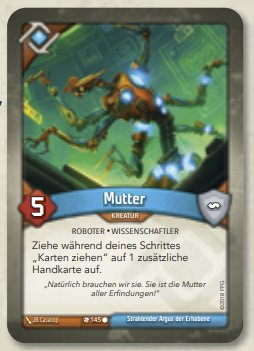

### KETTEN

Ketten repräsentieren übernatürliche Fesseln, welche die Architekten
manchen Archonten auferlegen, sei es, um ihre persönliche Entwicklung
zu fördern oder um einen Verstoß gegen die Regeln oder Etikette des
Schmelztiegels zu bestrafen.

Im Laufe des Spiels können Kartenfähigkeiten bewirken, dass ein Spieler
Ketten erhält. Sobald ein Spieler Ketten erhält, erhöht er seinen Kettenanzeiger um die Anzahl der erhaltenen Ketten.

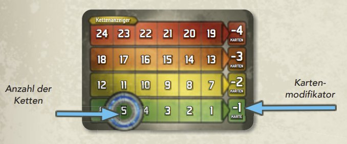

Immer wenn (auch während des Spielaufbaus) ein Spieler mit 1 oder mehreren
Ketten zum Auffüllen seiner Hand 1 oder mehrere Karten nachziehen würde,
zieht er, abhängig von seiner aktuellen Kettenstufe, auf weniger Handkarten auf
und sprengt dann 1 Kette, indem er seinen Kettenanzeiger um 1 reduziert.

Je mehr Ketten ein Spieler hat, desto höher fällt die Strafe aus.

* **1–6 Ketten**: Der Spieler zieht auf 1 Karte weniger auf.
* **7–12 Ketten**: Der Spieler zieht auf 2 Karten weniger auf.
* **13–18 Ketten**: Der Spieler zieht auf 3 Karten weniger auf.
* **19–24 Ketten**: Der Spieler zieht auf 4 Karten weniger auf.

_**Beispiel**: Vicki wurden 7 Ketten zugewiesen. Während des Spielaufbaus zieht
Vicki 2 Karten weniger und sprengt 1 Kette. Die nächsten 6 Male zieht Vicki
beim Auffüllen ihrer Hand auf 5 Karten auf und sprengt jeweils eine weitere
Kette. Nachdem sie alle Ketten gesprengt hat, zieht Vicki wieder auf die
normale Handkartenzahl auf._

#### KETTEN-HANDICAP (OPTIONAL)

Wenn zwei unterschiedlich starke Decks gegeneinander antreten, kann für
das stärkere Deck ein Handicap in Form von Ketten festgesetzt werden. Diese
Methode eignet sich eher dafür, um ein faires Spiel zwischen zwei bekannten
Decks zu ermöglichen, und weniger, um ein potenziell unfaires Spiel zwischen
zwei unbekannten Decks zu verhindern. Bei neuen Decks und auf Turnieren
kommt dieses Handicap nicht zum Einsatz.

##### EMPFEHLUNGEN FÜR DAS ZUWEISEN VON KETTEN

Wenn ihr das Gefühl habt, ein bestimmtes Deck ist stärker als das andere,
könnt ihr es mit 4 Ketten beginnen lassen. Immer wenn es ab jetzt drei
Mal hintereinander gegen das andere Deck gewinnt, erhöht ihr die Anzahl
seiner Ketten um 1. Verliert es drei Mal hintereinander, könnt ihr es mit 1
Kette weniger starten lassen.

Je öfter ihr das Deck gegen andere Decks aus eurer Sammlung antreten
lasst, desto genauer wird sich die Anzahl der Ketten einpendeln und je
nach Paarung (abhängig von seiner Effektivität gegen bestimmte Decks)
schwanken.

##### DECKS MIT KETTEN ERSTEIGERN

Wenn ihr euch gut mit euren Decks auskennt, könnt ihr die empfohlene
Anzahl der Ketten auch ignorieren und stattdessen das Recht versteigern,
um mit einem bestimmten Deck spielen zu dürfen. Gebote werden
hierbei in Ketten abgegeben.

_**Beispiel**: Teresa und Julia wollen mit den Decks „Mutter Mahospot“
und „Kanzler Fischer“ spielen. „Mutter Mahospot“ ist ein Deck, das
beide Spielerinnen gut kennen, für relativ stark halten und gerne spielen.
„Kanzler Fischer“ ist ein neueres Deck, an das sich die Spielerinnen erst
noch gewöhnen müssen. Die oben genannten Richtlinien empfehlen,
„Mutter Mahospot“ mit 4 Ketten starten zu lassen. Julia wirft einen
Blick auf „Kanzler Fischer“, überlegt kurz und sagt: „Ich spiele ‚Mutter
Mahospot‘ mit 5 Ketten.“ Teresa erhöht auf 6 Ketten. Julia bietet 7.
Teresa beschließt, ihr das Deck für 7 Ketten zu überlassen, und spielt
„Kanzler Fischer“._

### WIE GEHT’S WEITER?

Jetzt kennt ihr alle wichtigen Grundregeln. Der nächste Abschnitt dieses
Dokuments enthält ein Glossar, das sich mit den Feinheiten des Spiels
beschäftigt. Dort könnt ihr nachschlagen, wenn während des Spiels oder beim
Interpretieren von Kartenfähigkeiten Fragen aufkommen.

# GLOSSAR

Das folgende Glossar ist eine alphabetische Auflistung diverser Konzepte und
Begriffe, denen man im Laufe des Spiels begegnen kann. Wir empfehlen, es
nicht von Anfang bis Ende durchzulesen, sondern gezielt nachzuschlagen,
wenn beim Spielen etwas unklar ist.

#### „+1-STÄRKE“-KARTE, STÄRKE-STATUSKARTE, STÄRKEMARKER

Sobald einer Kreatur eine „+1 Stärke“-Karte gegeben wird, legt man
1 entsprechende Stärke-Statuskarte auf die Kreatur. Für jede dieser Karten
steigt die Stärke der Kreatur um 1.

Eine „+1 Stärke“-Karte oder Stärke-Statuskarte ist wie ein Stärkemarker zu
behandeln und umgekehrt.

#### ABLAGESTAPEL

Sobald eine Karte zerstört oder abgelegt wird, legt man sie auf den
Ablagestapel ihres Besitzers. Der Inhalt der Ablagestapel ist für beide Spieler
eine offene Information und kann jederzeit eingesehen werden.

Die Reihenfolge der Karten in den Ablagestapeln bleibt im Laufe des Spiels
erhalten, es sei denn, eine Kartenfähigkeit verändert sie.

Sobald einem Spieler die Karten in seinem Deck ausgehen, mischt er seinen
Ablagestapel und bildet daraus ein neues Deck.

#### ÆMBER

Æmber wird durch Æmbermarker dargestellt und zum
Schmieden von Schlüsseln benötigt.

Nur Æmber im eigenen Æmber-Vorrat wird für Karteneffekte
als „deines“ betrachtet.

**Siehe auch**: [Erbeuten](#erbeuten), [Ernten](#ernten), [Schlüssel](#schluessel), [Stehlen](#stehlen)

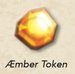

#### ÆMBER-BONUSSYMBOL

Siehe [„Bonussymbole“](#bonussymbole).

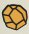

#### AKTIONSFÄHIGKEIT

Um eine **„Aktion:“**-Fähigkeit zu verwenden, muss der aktive Spieler in seinem
Zug die Karte erschöpfen. Dann wird die Fähigkeit abgehandelt.

#### AKTIVE FRAKTION

Die aktive Fraktion ist die Fraktion, die der aktive Spieler für den aktuellen
Zug gewählt hat.

#### AKTIVER SPIELER

Der aktive Spieler ist der Spieler, der gerade am Zug ist. Er trifft alle
notwendigen Entscheidungen bezüglich der Kartenfähigkeiten und TimingKonfl ikte, die während seines Zuges abgehandelt werden müssen.

#### ALPHA

Hat eine Karte das Schlüsselwort Alpha, kann sie nur gespielt werden, falls im
aktuellen Schritt deines Zugs noch keine andere Karte gespielt, verwendet
oder abgelegt worden ist.

#### ALS OB SIE DEINE WÄRE / ALS OB DU SIE KONTROLLIEREN WÜRDEST

Falls ein Karteneffekt dich anweist, eine Karte zu verwenden, „als ob sie deine
wäre“ oder „als ob du sie kontrollieren würdest“, führt dies dazu, dass du die
Karte verwendest, auch wenn du sie nicht kontrollierst. Du erhältst bei diesem
Prozess nicht die Kontrolle über die Karte, handelst sie aber ab, als ob du die
Karte kontrollieren würdest.

Sobald du eine Karte verwendest, „als ob sie deine wäre / als ob du sie
kontrollieren würdest“, die dich dazu anweist, als Teil des Effekts die Karte zu
opfern, wird die Karte geopfert, als würdest du sie kontrollieren.

#### ANDAUERNDE EFFEKTE

Manche Kartenfähigkeiten erzeugen Effekte oder Zustände, die das Spiel für
eine bestimmte Zeitdauer beeinfl usst (z. B. „bis zum Beginn deines nächsten
Zuges“ oder „für den Rest des Zuges“). Diese Effekte werden andauernde
Effekte genannt.

Andauernde Effekte werden wie konstante Fähigkeiten behandelt, die für die
Zeitdauer aktiv sind, die der Effekt angibt. Ein andauernder Effekt bleibt auch
bestehen, falls die Karte, die den Effekt erzeugt hat, das Spiel verlässt.

Falls ein andauernder Effekt Karten im Spiel beeinfl usst, gilt das für alle
Karten im Spiel während der bestimmten Zeitdauer, unabhängig davon, ob
sie im Spiel waren, als der andauernde Effekt begonnen hat.

#### ANDERE MARKER

Manche Karten beziehen sich auf Marker, für die es im Spiel kein offizielles
Spielmaterial gibt. Diese Marker können durch beliebige andere verfügbare
Gegenstände (z. B. Münzen, Papierschnipsel oder auch Poker-Chips)
repräsentiert werden. Diese Marker haben an sich keinen Spieleffekt, aber die
Karten, durch die sie erschaffen werden, beschreiben auch die Funktionsweise
der Marker.

##### LISTE DER MARKERARTEN

* Gesucht-Marker
* Intrigenmarker
* Luntenmarker
* Ruhmesmarker
* Störmarker
* Verderbensmarker
* Wachstumsmarker

#### ANGRIFF, ANGREIFER, ANGREIFEN

Siehe [„Kampf”](#kampf).

#### ANOMALIE

Dieses Symbol bedeutet, dass eine Karte eine Anomalie ist.
Eine Anomalie ist eine extrem seltene Kartenvariante, die eine
Vorschau auf ein mögliches zukünftiges KeyForge-Set darstellt.
Eine Anomalie kann in jeder Fraktion vorkommen. Sie gilt in
allen Belangen als Karte dieser Fraktion.

#### ANSTURM (X)

Sobald eine Kreatur mit dem Schlüsselwort Ansturm (X) angreift, fügt sie der
bekämpften Kreatur X Schaden zu, bevor der Kampf abgehandelt wird. (Der
aktive Spieler entscheidet, ob dies vor oder nach anderen „Vor dem Kampf“-
Effekten und Schlüsselwörtern geschieht.) Falls dieser Schaden die andere
Kreatur zerstört, findet der Rest des Kampfes nicht statt.

Falls eine Kreatur mit dem Schlüsselwort Ansturm (X) eine weiteres Mal des
Schlüsselwortes Ansturm (X) erhält, werden die beiden X-Werte addiert.

#### ARCHIV

Das Archiv eines Spielers ist ein verdeckter Spielbereich vor seiner
Avatarkarte. Kartenfähigkeiten sind die einzige Möglichkeit, die es dem
Spieler erlauben, Karten ins Archiv zu legen. Nachdem ein Spieler in Schritt 2
seines Zuges seine aktive Fraktion gewählt hat, darf er alle Karten aus seinem
Archiv nehmen und seiner Hand hinzufügen.

Karten, die im Archiv eines Spielers liegen, sind nicht im Spiel.
Das eigene Archiv darf jederzeit angesehen werden. Ein Spieler darf sich das
Archiv des Gegners nicht ansehen.

Falls eine Fähigkeit einen Spieler anweist, eine Karte zu archivieren,
ohne anzugeben, woher die archivierte Karte stammt, kommt die archivierte
Karte von der Hand des Spielers.

#### „AUF DIESE WEISE“

Bezieht sich eine Fähigkeit auf einen Effekt, der „auf diese Weise“ geschehen
ist, ist damit ein Effekt gemeint, der im Zuge derselben Abhandlung dieser
Fähigkeit eingetreten ist.

#### BEFREUNDET

Bezieht sich eine Kartenfähigkeit auf ein „befreundetes“ Spielelement, ist
damit ein Element gemeint, das sich aktuell unter der Kontrolle desselben
Spielers befindent.

#### BENACHBART

Bezieht sich eine Kreaturenkarte auf ein Spielelement, das sich „benachbart“
zu jener Kreatur befindent oder „benachbart“ zu jener Kreatur gespielt wird,
bezieht sie sich auf eine Karte, die sich in der Position direkt links oder rechts
neben jener Kreatur befindet oder die in die Position direkt links oder rechts
neben jener Kreatur gespielt wird.

**Siehe auch**: [Nachbar](#nachbar)

#### BESCHÜTZEN, BESCHÜTZT

Sobald eine Kreatur beschützt wird, legt man einen Beschützt-Marker auf sie.
Sobald eine Kreatur mit einem Beschützt-Marker auf sich beschädigt werden
würde, zerstört werden würde oder das Spiel verlassen würde, werden
stattdessen alle Beschützt-Marker von ihr abgelegt. (**Hinweis**: Dies verhindert,
dass die Kreatur zum Zerstören markiert wird.)

Solange eine Kreatur einen Beschützt-Marker auf sich hat, kann sie nicht
erneut beschützt werden.

Falls ein Beschützt-Marker auf eine Kreatur gelegt wird, nachdem sie bereits
zum Zerstören markiert wurde, wird der Beschützt-Marker nicht verhindern,
dass die Kreatur das Spiel verlässt. Er wird jedoch verhindern, dass die
Kreatur auf andere Weise das Spiel verlässt, z. B. dass sie auf die Hand
zurückgeschickt wird.

#### BETÄUBEN, BETÄUBT-STATUSKARTE, BETÄUBT-MARKER

Sobald eine Kreatur betäubt wird, legt man eine Betäubt-Statuskarte auf
sie. Solange eine Kreatur betäubt ist, kann sie weder kämpfen, ernten noch
**„Aktion:“**- oder **„Universell:“**-Fähigkeiten verwenden.

Immer wenn eine betäubte Kreatur normalerweise verwendet werden könnte,
kann sie stattdessen verwendet werden, indem sie erschöpft wird, um ihre
Betäubt-Statuskarte zu entfernen.

Falls ein Karteneffekt dazu führen würde, dass eine betäubte Kreatur kämpft,
erntet oder eine **„Aktion:“**- oder **„Universell:“**-Fähigkeiten verwendet, wird
diese Kreatur stattdessen erschöpft und die Betäubt-Statuskarte von ihr
entfernt. Dies gilt als „Verwenden“ der Kreatur.

Konstante Fähigkeiten und Fähigkeiten, die nicht voraussetzen, dass die
Kreatur kämpft, erntet oder verwendet wird, bleiben aktiv.
Wird eine betäubte Kreatur angegriffen, fügt sie während des Kampfes der
angreifenden Kreatur trotzdem Schaden zu.

Solange eine Kreatur betäubt ist, kann sie keine weitere Betäubt-Statuskarte
erhalten. Falls ein Effekt versucht, eine betäubte Kreatur zu betäuben,
betäubt dieser Effekt die bereits betäubte Kreatur nicht.

Eine Betäubt-Statuskarte ist wie ein Betäubt-Marker zu behandeln
und umgekehrt.

#### BEZAHLEN

Falls ein Spieler seinem Gegner Æmber bezahlen muss, wird das Æmber
aus dem Vorrat des bezahlenden Spielers entfernt und dem Vorrat des
Gegners hinzugefügt.

####  BONUSSYMBOLE

Viele Karten haben oben links, unter ihrem Fraktionssymbol, ein oder mehrere
Bonussymbole. Nachdem eine Karte mit einem Bonussymbol gespielt
worden ist, handelt der aktive Spieler als Allererstes jedes Bonussymbol
auf der Karte ab. Das Abhandeln der Symbole passiert, nachdem die Karte
ins Spiel gekommen ist (falls es sich um ein Artefakt, eine Kreatur oder
eine Aufwertung handelt), aber vor dem Abhandeln jedweder „Spielen:“-
Fähigkeiten auf der Karte oder Fähigkeiten, die ausgelöst werden,
„nachdem“ die Karte gespielt worden ist.

Bonussymbole müssen in der aufgedruckten Reihenfolge, von oben nach
unten, abgehandelt werden. Das Abhandeln jedes Bonussymbols ist Pflicht.

Es gibt vier Arten von Bonussymbolen:

**Æmber** (A): Du erhältst 1 Æmber.

**Erbeuten** (PT): Eine befreundete Kreatur erbeutet 1 Æmber vom Gegner.
Dieses Æmber darf von einer beliebigen befreundeten Kreatur erbeutet
werden, auch von der Kreatur mit dem Erbeuten-Symbol. Hat eine Karte
mehrere Erbeuten-Symbole, so darf das erbeutete Æmber auf mehrere
Kreaturen aufgeteilt werden.

**Schaden** (D): Füge einer Kreatur im Spiel 1 Schaden zu. Dieser Schaden
darf der Kreatur mit dem Schadenssymbol zugefügt werden. Beachte, dass
dieser Schaden einer befreundeten Kreatur zugefügt werden muss, falls
keine feindlichen Kreaturen im Spiel sind. Hat eine Kreatur mehrere 
SchadenSymbole, so wird jedes Schadenssymbol, eines nach dem anderen, separat
abgehandelt und der Schaden darf auf mehrere Kreaturen aufgeteilt werden.
Schaden, der durch ein Bonussymbol zugefügt wird, gilt nicht als von der
Karte zugefügt, auf der das Symbol auftaucht.

**Ziehen** (R): Ziehe 1 Karte.

#### DÜRFEN

Verwendet eine Fähigkeit eine Form von „dürfen“, ist der Text nach dem
„dürfen“ optional. Falls man sich für das Abhandeln einer „Dürfen“-Fähigkeit
entscheidet, muss man sie so weit wie möglich abhandeln.

#### EBBE UND FLUT

Ebbe und Flut ist eine Spielmechanik aus einer möglichen zukünftigen
Erweiterung. Zu Beginn einer Partie herrscht weder Ebbe noch Flut.
Zukünftige Kartenfähigkeiten können dies ändern. Derzeit gibt es aber noch
keine Fähigkeit, die eine solche Fähigkeit hat.

#### ENDE DES ZUGES

„Ende des Zuges“-Effekte werden abgehandelt, sobald der Zug eines
Spielers vorbei ist - also nach Schritt 5 „Karten ziehen“.

#### ERBEUTEN

Erbeutetes Æmber wird aus dem Æmber-Vorrat des Gegners genommen
und auf eine Kreatur unter der Kontrolle des Spielers gelegt, der es erbeutet
hat. Erbeutetes Æmber darf nicht ausgegeben werden.

Sobald eine Kreatur, die Æmber auf sich hat, das Spiel verlässt,
wird das Æmber in den Æmber-Vorrat des Gegners gelegt.

Sofern nichts anderes angegeben ist, wird erbeutetes Æmber auf
die Kreatur gelegt, die es erbeutet hat.

#### ERBEUTEN-BONUSSYMBOL

Siehe [„Bonussymbole“](#bonussymbole).

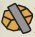

#### ERHEBEN

Sobald ein Effekt anweist, eine Kreatur zu „erheben“, wird 1 Æmber aus der
allgemeinen Reserve auf die Kreatur gelegt.

**Hinweis**: Sobald eine Kreatur, die Æmber auf sich hat, das Spiel verlässt, wird
das Æmber in den Æmber-Vorrat des Gegners gelegt.

#### ERNTEN

Sobald ein Spieler eine Kreatur zum Ernten verwendet, erschöpft er die
Kreatur und erhält 1 Æmber in seinen Æmber-Vorrat. Dann werden alle
**„Ernte:“**-Fähigkeiten der Kreatur abgehandelt.

#### ERSATZEFFEKTE

Manche Fähigkeiten ersetzen vollständig die Abhandlung eines anderen
Effekts oder Spielschritts. Diese Fähigkeiten werden „Ersatzeffekte“ genannt
und können daran erkannt werden, dass sie die Begriffe „stattdessen“ oder
„(an)statt“ verwenden. Ein Ersatzeffekt gibt an, welchen Teil eines Effekts
oder Spielschritts er ersetzt. Sobald dieser Effekt (oder Teil eines Effekts) oder
Spielschritt stattfinden würde, findet er nicht statt und der Ersatzeffekt tritt an
seine Stelle.

Falls ein Ersatzeffekt dazu führt, das etwas, das zum Zerstören markiert ist,
nicht zerstört wird, so wird dieser Ersatzeffekt nicht abgehandelt, bis die
Karte auf den Ablagestapel gelegt werden würde. Sobald die Karte auf den
Ablagestapel gelegt werden würde, wird stattdessen die Zerstört-Markierung
davon entfernt und die Anweisungen des Zerstören-Ersatzeffekts werden
fertig abgehandelt.

Falls der Ersatzeffekt keinen Effekt angibt, bezieht er sich auf einen anderen
Teil desselben Effekts, von dem der Ersatzeffekt ein Teil ist.

_**Beispiel**: Andreas spielt ein Dimensionsportal (RdA 108) und erntet dann mit
einer Kreatur. Normalerweise würde Andreas durch das Ernten mit seiner
Kreatur 1 Æmber erhalten. Das Dimensionsportal hat aber einen Ersatzeffekt
erzeugt, der das Erhalten von Æmber durch Ernten mit dem Stehlen von
Æmber ersetzt. Deshalb stiehlt Andreas stattdessen 1 Æmber._

_**Beispiel**: Kathi hat Feldherr Remiel (RdA 241), an den ein ArmageddonMantel (RdA 263) angelegt ist. Ihr Gegner spielt eine Pforte nach Dis (RdA 059), wodurch jede Kreatur im Spiel zerstört wird. Der Zerstört-Effekt,
den der Armageddon-Mantel Feldherr Remiel gewährt, ist ein Ersatzeffekt,
der das Zerstören dieser Kreatur durch die Komplettheilung von Feldherr
Remiel und die Zerstörung des Armageddon-Mantels ersetzt. Das führt
dazu, dass die Zerstört-Markierung von Feldherr Remiel entfernt und dem
Armageddon-Mantel gegeben wird._

_**Beispiel**: Janine spielt Ronnie Uhrich (ZdA 276), während ihr Gegner 7 Æmber
hat. Normalerweise würde der Spielen-Effekt von Ronnie Uhrich 1 Æmber von
Janines Gegner stehlen. Da dieser aber 7 Æmber hat, kommt der Ersatzeffekt
zum Tragen und ersetzt stattdessen das Stehlen von 1 Æmber mit dem
Stehlen von 2 Æmber._

#### EXPLOSION

Sobald eine Fähigkeit einer Kreatur Schaden mit „Explosion“ zufügt,
wird jedem Nachbarn der Kreatur der Explosionsschaden zugefügt.

#### FÄHIGKEIT, KARTENFÄHIGKEIT

Eine Fähigkeit ist der besondere Text einer Karte, der sich auf das
Spielgeschehen auswirkt.

Sofern sich eine Fähigkeit nicht ausdrücklich auf einen Nicht-im-Spiel-Bereich
(wie die Hand, das Deck, das Archiv oder den Ablagestapel) bezieht, kann
sie nur mit Karten interagieren, die im Spiel sind. Fähigkeiten, die mit einer
Karte interagieren, nachdem sie zerstört worden ist, können mit jener Karte
interagieren, solange sie sich im Ablagestapel befindet.

Fähigkeiten auf einer Kreatur, einem Artefakt oder einer Aufwertung sind nur
dann aktiv (und können nur dann ausgelöst werden), solange sich jene Karte
im Spiel befindet, es sein denn, die Fähigkeit gibt ausdrücklich an, dass sie
von einem Nicht-im-Spiel-Bereich verwendet werden kann. Einmal ausgelöst,
wird eine Kartenfähigkeit bis zum Ende abgehandelt, selbst wenn die Karte
das Spiel verlässt.

Falls das Abhandeln eines Teils der Anweisungen einer Kartenfähigkeit dazu
führt, dass andere Karteneffekte ausgelöst werden, werden zunächst diese
anderen Karteneffekte abgehandelt, bevor die restlichen Anweisungen der
ersten Karte abgehandelt werden.

#### „FALLS DU DAS TUST“ UND „UM ZU”

Falls eine Fähigkeit die Formulierung „falls du das tust“ oder „um zu“
enthält, muss der Spieler, auf den sich die Fähigkeit bezieht, den Text vor
dieser Formulierung vollständig und erfolgreich abgehandelt haben, bevor
er den Text hinter der Formulierung abhandeln oder durchführen kann.
Anders ausgedrückt: Falls der erste Teil der Fähigkeit nicht vollständig und
erfolgreich abgehandelt wird, kann der zweite Teil nicht abgehandelt oder
durchgeführt werden.

#### FEINDLICH

Bezieht sich eine Kartenfähigkeit auf ein „feindliches“ Spielelement,
ist damit ein Element gemeint, das sich aktuell unter der Kontrolle des
Gegners befindet.

#### FLANKE

Die Kreaturen am linken und rechten Ende der Schlachtreihe eines Spielers
befinden sich an den Flanken der Schlachtreihe. Eine Kreatur in dieser
Position wird auch als Flankenkreatur bezeichnet. Immer wenn eine Kreatur ins
Spiel kommt oder die Kontrolle wechselt, wählt der aktive Spieler, an welche
Flanke der Schlachtreihe ihres kontrollierenden Spielers sie gelegt wird.

Falls eine Schlachtreihe nur eine Kreatur enthält, befindet sich diese
Kreatur sowohl an der linken als auch an der rechten Flanke und wird als
Flankenkreatur behandelt.

#### FRAKTIONSFREMD

Eine fraktionsfremde Karte ist eine Karte, die nicht zur aktiven Fraktion gehört.

#### FRAKTIONSWAHL

In jedem Zug muss ein Spieler 1 der 3 Fraktionen auf seiner Avatarkarte
wählen (falls möglich). Manche Kartenfähigkeiten können die Fraktions wahl
des Spielers einschränken.

Hat ein Spieler die Kontrolle über eine Karte übernommen, die nicht zu 1
seiner 3 Fraktionen gehört, wird die Fraktion dieser Karte ebenfalls wählbar,
solange er die Kontrolle über die Karte behält.

Gibt es keine Fraktion, die regelkonform gewählt werden konnte, muss der
Zug ohne aktive Fraktion gespielt werden.

Falls ein Spieler 2 (oder mehr) Anweisungen hat, die besagen, dass er etwas
„wählen muss“, darf er eine dieser Optionen wählen.

#### „FÜR JEDEN“, „FÜR JEDE“, „FÜR JEDES“

Manche Fähigkeiten haben einen Effekt, der den Begriff „für jeden“, „für
jede“ oder „für jedes“ verwendet, um den Umfang des Effekts zu bestimmen.
Sofern nichts anderes angegeben ist, darf ein Spieler jeweils eine andere
Karte für jede Instanz eines solchen Effekts wählen, die davon betroffen wird.

_**Beispiel**: Der Text von Scherbe des Schmerzes (ZdA 104) lautet: „**Aktion:**
Füge einer feindlichen Kreatur für jede befreundete Scherbe 1 Schaden zu.“
Dieser Schaden darf auf mehrere Kreaturen aufgeteilt werden._

Manche Fähigkeiten geben an, dass „eine Kreatur gewählt“ werden muss.
Dann wird bei jener Kreatur ein Effekt angewandt, der den Begriff „für
jeden“, „für jede“ oder „für jedes“ verwendet. Solche Fähigkeiten betreffen
nur eine einzige Kreatur.

_**Beispiel**: Der Text von Strahlenpistole vom Mars (RdA 211) lautet: „Diese
Kreatur erhält: ‚**Ernte**: Wähle eine Kreatur. Füge jener Kreatur 1 Schaden
für jede Mars-Kreatur im Spiel zu.‘“ Dieser Schaden muss ausschließlich der
gewählten Kreatur zugefügt werden und kann nicht auf mehrere Kreaturen
aufgeteilt werden._

#### GEFÄHRLICH (X)

Sobald eine Kreatur mit dem Schlüsselwort Gefährlich (X) angegriffen
wird, fügt sie der angreifenden Kreatur X Schaden zu, bevor der Angriff
abgehandelt wird. (Der aktive Spieler entscheidet, ob dies vor oder nach
anderen „Vor dem Kampf:“-Effekten und Schlüsselwörtern geschieht.) Falls
dieser Schaden die andere Kreatur zerstört, findent der Rest des Kampfes
nicht statt.

Falls eine Kreatur mit dem Schlüsselwort Gefährlich (X) ein weiteres Mal das
Schlüsselwort Gefährlich (X) erhält, werden die beiden X-Werte addiert.

#### GEGNERISCH

Ist eine Kreatur in einen Kampf verwickelt (entweder weil sie zum Kämpfen
verwendet worden ist oder weil sie von einer anderen Kreatur angegriffen
worden ist), betrachtet sie die jeweils andere Kreatur im Kampf als
gegnerische Kreatur.

#### GIFT
Jeder Schaden, den eine Kreatur mit dem Schlüsselwort Gift während
eines Kampfes durch ihre Stärke zufügt, zerstört die beschädigte Kreatur.
Dies passiert, sobald der Schaden erfolgreich auf die gegnerische Kreatur
gelegt wird.

Gift hat keine Wirkung, falls der gesamte Schaden durch Rüstung oder durch
eine andere Fähigkeit verhindert wird - Gift wird nur dann abgehandelt,
sobald mindestens 1 Schaden erfolgreich zugefügt wird.

Gift bezieht sich nur auf den Schaden, der durch die Stärke der Kreatur
zugefügt wird, nicht auf Schaden, der durch Schlüsselwörter oder andere
Kartenfähigkeiten zugefügt wird.

#### GIGANTISCHE KREATUREN

Gigantische Kreaturen sind auf je 2 Karten aufgeteilt: Auf der einen Karte ist
der Textkasten der Kreatur zu findenn, während auf der anderen Karte ihr Bild
zu sehen ist.

Um eine gigantische Kreatur zu spielen, muss der Spieler beide Hälften der
Kreatur auf seiner Hand haben und beide Karten zusammen als eine einzige
Kreatur spielen. Die obere Hälfte einer gigantischen Kreatur weist den Text
„1 von 2“ neben ihrem Kartentitel auf, während die passende untere Hälfte
denselben Titel und den Text „2 von 2“ neben ihrem Seltenheitssymbol hat.

Eine gigantische Kreatur zählt als 2 Karten, solange sie nicht im Spiel ist,
aber als 1 einzelne Kreaturenkarte, solange sie im Spiel ist. Das Spielen einer
gigantischen Kreatur zählt, als würde man 1 Karte spielen und ist daher im
ersten Zug erlaubt. Nachdem eine gigantische Kreatur das Spiel verlassen
hat, werden die beiden Hälften wieder als 2 separate Karten behandelt.

Beide Hälften einer gigantischen Kreatur haben denselben Kartentitel,
dieselbe Fraktion und dieselbe Kartenart. Ansonsten hat jede Hälfte die
Attribute, die auf ihr aufgedruckt sind: Die obere Hälfte verfügt über
Bonussymbole, während die untere Hälfte Stärke, Rüstung und einen
Textkasten enthält.

Wenn eine Karte dazu anweist, eine Kreatur zu spielen oder ins Spiel zu
bringen, und dabei eine Hälfte einer gigantischen Kreatur als Ziel wählt, so
scheitert dieser Effekt. Weist eine Karte hingegen dazu an, beide Hälften
einer gigantischen Kreatur zu spielen oder ins Spiel zu bringen, so wird die
gigantische Kreatur gespielt bzw. ins Spiel gebracht.

_**Beispiel**: Isabell spielt ein Wildes Wurmloch. Dies gestattet ihr, die oberste
Karte ihres Decks zu spielen. Sie sieht sich die oberste Karte ihres Decks an
und stellt fest, dass es sich um die obere Hälfte von Ultra Gravitron handelt.
Sie kann diese Karte nicht von oben von ihrem Deck spielen (selbst wenn sie
die andere Hälfte auf der Hand hätte). Daher legt sie die Karte oben auf ihr
Deck zurück._

#### HEILEN

Falls eine Kreatur durch einen Karteneffekt „geheilt“ wird, entfernt man die
entsprechende Menge an Schaden von der Kreatur.

Falls eine Kreatur durch einen Karteneffekt „komplett geheilt“ wird, entfernt
man sämtlichen Schaden von der Kreatur.

Jede Kreatur kann gewählt werden, um durch einen Karteneffekt geheilt
zu werden, auch wenn sie keine Schadensmarker auf sich hat. Falls jedoch
keine Schadensmarker von der Kreatur entfernt werden, gilt sie in Bezug auf
Karteneffekte, die sich auf die Heilung beziehen, nicht als „geheilt“.

#### HEIMGESUCHT

Falls ein Spieler 10 oder mehr Karten in seinem Ablagestapel hat, wird er
heimgesucht. Dies hat an sich keinen Spieleffekt. Andere Kartenfähigkeiten
können aber Bezug darauf nehmen.

#### KAMPF
Sobald man eine Kreatur zum Kämpfen verwendet, erschöpft man die Kreatur
und wählt eine Kreatur des Gegners. Beide Kreaturen fügen der jeweils
gegnerischen Kreatur Schaden in Höhe ihres Stärkewertes zu. Beide Kreaturen
„kämpfen“ oder sind „im Kampf verwickelt“, was Karteneffekte betrifft.
Die zum Kämpfen verwendete Kreatur gilt als „angreifende Kreatur“ und kann
während des Kampfes auch als „Angreifer“ bezeichnet werden.

Falls der Angreifer nicht zerstört wird, werden anschließend alle **„Kampf:“**-
Fähigkeiten der angreifenden Kreatur abgehandelt. Hat eine der am Kampf
beteiligten Kreaturen eine konstante Fähigkeit, die sich auf das Ende
des Kampfes bezieht (z. B.: „Nachdem eine feindliche Kreatur im Kampf
gegen diese Kreatur zerstört worden ist ...“), muss die Kreatur den Kampf
überleben, um die Fähigkeit abhandeln zu können. Nur der Angreifer kann
**„Kampf:“**-Fähigkeiten auslösen.

Wird beim Abhandeln von Ansturm oder Gefährlich oder einer **„Vor dem
Kampf:“**-Fähigkeit entweder die angreifende oder die verteidigende
Kreatur zerstört, so wird der Kampf (das Zufügen von Schaden, basierend
auf Stärke) übersprungen. Die Kreaturen „kämpfen“ nicht und sind
nicht „im Kampf verwickelt“, was Karteneffekte betrifft. Ebenso werden
die **„Kampf:“**-Fähigkeiten der angreifenden Kreatur nicht ausgelöst.
Karteneffekte mit den Formulierungen „nachdem eine Kreatur gekämpft
hat“ oder „nachdem eine Kreatur verwendet worden ist“ werden dennoch
ausgelöst, da die Kreatur zum Kämppfen verwendet worden ist (auch wenn der
Kampf nicht abgehandelt wurde).

#### „KÄMPFEN LASSEN“

Falls eine Fähigkeit einen Spieler anweist eine Kreatur „kämpfen zu lassen“
oder „spielbereit zu machen und kämpfen zu lassen“, so erhält man durch
diese Fähigkeit die Erlaubnis, die entsprechende Kreatur zum Kämpfen zu
verwenden. Der Kampf wird gemäß den Standardregeln gegen eine Kreatur
unter der Kontrolle des Gegners abgehandelt.

#### KANN NICHT VS. MUSS/DARF, KANN NICHT VS. „ERLAUBEN“-EFFEKT

Falls zwei Karteneffekte einen Spieler anweisen, dass er etwas „nicht
tun kann“ und dass er dasselbe tun „muss“ oder „darf“, hat der „Kann
nicht“-Effekt Vorrang.

_**Beispiel**: Anna kontrolliert einen Grubenfürst (RdA 093) mit dem Text:
„Solange Grubenfürst im Spiel ist, musst du Dis als deine aktive Fraktion
wählen.“ In ihrer nächsten Runde spielt Annas Gegnerin Restringuntus
(RdA 094) mit dem Text: „**Spielen**: Wähle eine Fraktion.“ 
Dein Gegner kann jene Fraktion nicht als seine aktive Fraktion wählen, bis
Restringuntus das Spiel verlässt.“ und wählt Dis durch seine Fähigkeit. In
der nächsten Runde muss Anna Dis wählen und kann Dis nicht wählen.
Weil aber „Kann nicht“ Vorrang vor „Muss“ hat, kann sie Dis nicht wählen
und muss stattdessen eine ihrer anderen Fraktionen wählen._

Falls zwei Karteneffekte einen Spieler gleichzeitig anweisen, dass er etwas nicht
tun kann und dass er etwas tun darf, hat der „Kann nicht“-Effekt Vorrang.

#### KETTE, KETTEN

Manche Kartenfähigkeiten führen dazu, dass ein Spieler 1 oder mehrere
Ketten erhält. Falls ein Spieler Ketten erhält, erhöht er seinen Kettenanzeiger
um die entsprechende Anzahl.

Falls ein Spieler beim Aufziehen von Handkarten mindestens 1 Kette hat und
aufgrund der Anzahl seiner verbleibenden Handkarten neue Karten ziehen
würde, zieht er gemäß folgender Tabelle auf weniger Karten auf. Dann
sprengt er 1 Kette, indem er seinen Kettenanzeiger um 1 reduziert.

* **1-6 Ketten**: Der Spieler zieht auf 1 Karte weniger auf.
* **7-12 Ketten**: Der Spieler zieht auf 2 Karten weniger auf.
* **13-18 Ketten**: Der Spieler zieht auf 3 Karten weniger auf.
* **19-24 Ketten**: Der Spieler zieht auf 4 Karten weniger auf.

Falls ein Deck während des Ziehens der Starthand beim Aufbau Ketten
hat, werden die Ketten auch für die Starthand angewendet, als ob man in
Schritt 5 die Hand nachfüllen würde. Dafür wird nach den Standardregeln eine
Kette gesprengt.

Siehe [„Ketten“](#ketten).

#### KONTROLLE
Ein Spieler besitzt alle Karten, die zu Spielbeginn in seinem Deck sind.
Sobald eine Karte gespielt wird, kommt sie unter der Kontrolle des aktiven
Spielers ins Spiel.

Es ist möglich, die Kontrolle über eine Karte des Gegners zu übernehmen.
Wenn das passiert, wird die Karte in den Spielbereich ihres neuen
kontrollierenden Spielers gelegt. Falls es sich um eine Kreatur handelt,
wird sie an eine Flanke der Schlachtreihe ihres neuen kontrollierenden
Spielers gelegt. Falls mehrere Effekte, welche die Kontrolle über eine
Karte übernehmen, auf dieselbe Karte verwendet werden, hat der jüngste
Effekt Vorrang.

Übernimmt ein Spieler die Kontrolle über eine Karte, die nicht zu einer
Fraktion seines Decks gehört, kann er in Schritt 2 seines Zuges auch die
Fraktion der übernommenen Karte als aktive Fraktion wählen.

Falls eine übernommene Karte aus irgendeinem Grund das Spiel verlässt, wird
sie in den entsprechenden Nicht-im-Spiel-Bereich ihres Besitzers verschoben.
Falls eine Fähigkeit sich auf Karten bezieht, die ein Spieler im Spiel „hat“,
dann bezieht sie sich auf Karten, die der Spieler kontrolliert.

#### KOSTEN, AKTUELLE KOSTEN

Die Standardkosten für das Schmieden eines Schlüssels sind 6 Æmber.
Kartenfähigkeiten können diese Kosten modifizieren. Die modifizierten
Kosten werden als aktuelle Kosten bezeichnet.

#### LEGACY

Dieses Symbol bedeutet, dass eine Karte eine Legacy-Karte ist.
Eine Legacy-Karte ist eine seltene Kartenvariante, die aus einem
vorherigen KeyForge-Set stammt. Sie gilt in allen Belangen als
Teil des Decks und ist auch auf Turnieren spielbar.

#### MERKMALE

Merkmale sind beschreibende Attribute (wie „Ritter“ oder „Gespenst“),
auf die andere Karten Bezug nehmen können. Sie stehen am oberen Rand
des Textfeldes einer Karte.

Merkmale haben an sich keinen Spieleffekt, allerdings gibt es
Kartenfähigkeiten, die Bezug auf sie nehmen.

#### MAVERICK
Dieses Symbol bedeutet, dass eine Karte ein Maverick ist.
Ein Maverick ist eine extrem seltene Kartenvariante, die ihre
normale Fraktion verlassen und sich einer anderen Fraktion
angeschlossen hat. Sie gilt in allen Belangen als Karte der Fraktion,
die auf der Karte aufgedruckt ist.

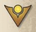

#### MULLIGAN

Während des Spielaufbaus hat jeder Spieler (beginnend mit dem Startspieler) 
genau 1 Gelegenheit, einen Mulligan zu nehmen. Dazu mischt er die Starthand 
in sein Deck zurück und zieht eine neue Starthand, die aus 1 Karte weniger 
besteht.

Nach dem Auswechseln muss die neue Starthand behalten werden.

Falls ein Spieler ein Deck verwendet, welches das Spiel mit Ketten beginnt, 
und er einen Mulligan nimmt, wird durch den Mulligan keine Kette gesprengt, 
sondern er zieht gemäß den normalen Mulligan-Regeln eine Karte weniger als 
zuvor.

#### NACHBAR

Die Kreaturen, die direkt links und rechts neben einer Kreatur in der 
Schlachtreihe eines Spielers liegen, sind die Nachbarn dieser Kreatur.

#### OBEN GENANNT, WIEDERHOLE DEN OBEN GENANNTEN EFFEKT

Falls ein Kartentext den Spielern die Anweisung gibt, einen oben genannten 
Effekt zu wiederholen, wird der gesamte Effekt bis zu der 
Wiederholungsanweisung noch einmal abgehandelt. 

**Anm.**: Das Wiederholen eines Effekts ist nicht von der Sechser-Regel 
betroffen, da die Sechser-Regel nur beim Spielen oder Verwenden von Karten 
gilt und nicht beim mehrmaligen Auslösen ihrer Effekte.

#### OMEGA

Nachdem eine Karte mit dem Schlüsselwort Omega gespielt worden ist, endet 
der aktuelle Spielschritt. Der aktive Spieler darf bis zum Ende des 
Schritts keine weiteren Karten spielen, verwenden und ablegen. Alle 
ausstehenden Effekte und Auslöser werden abgehandelt. Dann geht das Spiel 
im nächsten Schritt weiter.

#### OPFERN

Sobald ein Spieler dazu angewiesen wird, eine Karte zu opfern, muss er die 
Karte aus dem Spiel abgelegen. Geopferte Karten gelten als zerstört, d. h. 
ihre **„Zerstört:“**-Fähigkeiten werden abgehandelt.

Spieler können Karten nicht opfern, die sie selbst nicht kontrollieren.

#### RÜSTUNG

Manche Kreaturen haben einen Rüstungswert rechts neben ihrem Kartentitel. 
Rüstung verhindert in jedem Zug Schaden in Höhe des Rüstungswertes, den die 
Kreatur erleiden würde. Rüstung verhindert Schaden, bevor er zugefügt wird. 

_**Beispiel**: Einer Kreatur mit 2 Rüstung wird 1 Schaden zugefügt. Der 
Schaden wird von der Rüstung verhindert und die Kreatur behält für den Rest 
des Zuges noch 1 Rüstung übrig, die Schaden verhindern kann. Später in 
diesem Zug werden der Kreatur 3 Schaden zugefügt. 1 Schaden wird von der 
Rüstung verhindert, die restlichen 2 Schaden werden der Kreatur zugefügt._

Falls eine Kreatur Rüstung erhält, handelt es sich um einen zusätzlichen 
Bonus, der auf ihren aufgedruckten Rüstungswert addiert wird.

Falls eine Kreatur während eines Zuges Rüstung erhält, verhindert diese 
Rüstung keinen Schaden, der ihr zu einem früheren Zeitpunkt in diesem Zug 
zugefügt worden ist. 

Falls eine Kreatur während eines Zuges Rüstung verliert, wird ihr 
rückwirkend kein Schaden zugefügt, der durch die Rüstung bereits verhindert 
worden ist.

Wenn eine Kreatur irgendeine Menge an Rüstung verliert, verliert sie zuerst 
Rüstung, die verwendet worden ist, um Schaden in diesem Zug zu verhindern, 
bevor sie Rüstung verliert, die noch nicht verwendet worden ist, um Schaden 
in diesem Zug zu verhindern.

Das Symbol „~“ im Rüstungsfeld bedeutet, dass eine Kreatur keine Rüstung 
hat. Eine solche Kreatur kann trotzdem durch Karteneffekte Rüstung erhalten.

#### SCHADEN

Schadensmarker, die auf einer Kreatur liegen, zeigen an, wie viel Schaden 
diese Kreatur bereits erlitten hat. Falls eine Kreatur mindestens so viel 
Schaden hat, wie sie Stärke hat, wird die Kreatur zerstört. Der Schaden 
einer Kreatur reduziert nicht ihre Stärke. Falls mehrere Kreaturen durch 
denselben Effekt Schaden erleiden, wird der Schaden gleichzeitig zugefügt.

#### SCHADEN-BONUSSYMBOL

Siehe [„Bonussymbole“](#bonussymbole).

#### SCHARMÜTZEL

Sobald eine Kreatur mit dem Schlüsselwort Scharmützel zum Kämpfen verwendet 
wird, nimmt sie keinen Schaden durch die gegnerische Kreatur, sobald durch 
den Kampf Schaden zugefügt wird.

Dies bezieht sich nur auf Schaden, der über die Stärke der gegnerischen 
Kreatur zugefügt würde, nicht auf Schaden, der durch Schlüsselwörter oder 
andere Kartenfähigkeiten entsteht.

#### SCHLACHTREIHE

Die Schlachtreihe ist die geordnete Reihe von Kreaturen, die ein Spieler im 
Spiel hat und kontrolliert. Siehe [„Kreaturen“](#kreaturen).

#### SCHLÜSSEL

Der Spieler, der als Erster alle drei Schlüssel geschmiedet hat, gewinnt 
sofort das Spiel.

Jeder Spieler hat je einen Schlüssel der folgenden Farben: rot, blau und 
gelb. Manche Kartenfähigkeiten nehmen Bezug auf die Farbe der Schlüssel 
eines Spielers, zusätzlich dazu, ob sie geschmiedet oder ungeschmiedet sind.

Mehr zum Schmieden von Schlüsseln auf Seite 4.

#### SCHMIEDEN

Mehr zum Schmieden von Schlüsseln auf Seite 4.

#### SCHWÄCHSTE KREATUR

Die „schwächste“ Kreatur ist die Kreatur mit dem niedrigsten Stärkewert im 
Spiel. Falls dies auf mehrere Kreaturen zutrifft, gilt jede von ihnen als 
„die schwächste“.

Falls eine Fähigkeit die Auswahl einer einzelnen schwächsten Kreatur 
verlangt, wählt bei Gleichstand der aktive Spieler 1 der schwächsten 
Kreaturen aus.

**Gruppe von „schwächsten Kreaturen“**

Falls sich ein Karteneffekt auf eine Gruppe von „die X schwächsten“ 
Kreaturen bezieht, bezieht er sich auf eine Anzahl Kreaturen im Spiel mit 
derselben oder einer geringeren Stärke als jede Kreatur, die nicht zu 
dieser Gruppe gehört. Falls es nicht genügend Kreaturen mit der geringsten 
Stärke gibt, um die Gruppe zu bilden, kann eine Kreatur mit der 
nächsthöheren Stärke Teil der Gruppe werden. Dies gilt so lange, bis die 
Gruppe voll ist oder keine weiteren Kreaturen mehr vorhanden sind. Falls 
mehrere Kreaturen mit der gleichen Stärke der Gruppe beitreten könnten, es 
aber nicht genug Platz für alle diese Kreaturen in der Gruppe gibt, wählt 
der aktive Spieler, welche dieser Kreaturen Teil der Gruppe werden.

#### SCHWER ZU FASSEN

Wenn eine Kreatur mit dem Schlüsselwort „Schwer zu fassen“ zum ersten Mal 
in jedem Zug angegriffen wird, wird ihr in diesem Kampf kein Schaden 
zugefügt und sie fügt dem Angreifer keinen Schaden zu.

Schwer zu fassen verhindert nur Schaden, der durch die Stärke der Kreaturen 
zugefügt würde; Schaden, der durch Schlüsselwörter oder andere Fähigkeiten 
entsteht, wird trotzdem zugefügt.

#### SELBSTBEZÜGLICHER TEXT

Bezieht sich die Fähigkeit einer Karte auf ihren eigenen Titel, ist damit 
nur die Karte selbst und keine andere Kopie dieser Karte gemeint.

Wenn eine Karte den Text einer anderen Karte kopiert oder erhält, bezieht 
sich jeder selbstbezügliche Text nun auf die Kreatur, die den Text erhalten 
hat.

_**Beispiel**: Du verwendest Bekenntnis der Pfl ege, deckst Falscher 
Fünfziger von deiner Hand auf und wählst eine Staubfee im Spiel. Die 
Staubfee erhält effektiv den Text: „**Zerstört**: Schicke Staubfee auf 
deine Hand zurück.“_

Falls eine Aufwertung einer Kreatur eine Fähigkeit verleiht, die sich auf 
den Kartentitel der Aufwertung bezieht, dann gilt dies als 
selbstbezüglicher Text. Er bezieht sich nur auf diese Kopie der Aufwertung 
und nicht auf andere Kopien.Erhält eine Kreatur eine Fähigkeit, die sich 
auf ihren eigenen Kartentitel bezieht, dann gilt das als selbstbezüglicher 
Text.

#### SELTENHEIT
Die Seltenheit einer Karte (gewöhnlich, ungewöhnlich, selten oder Spezial) 
wird durch ein Symbol am unteren Kartenrand, neben der Sammler-ID 
angegeben. Der Deckbau-Algorithmus verwendet die Seltenheit, um 
festzulegen, wie häufig eine Karte in Decks erscheinen wird. Spezial-Karten 
werden nach anderen Gesichtspunkten verteilt und richten sich nicht nach 
den normalen Seltenheitsregeln des Spiels.

GewöhnlichUngewöhnlichSeltenSpezial

#### SPIELEN

Die **„Spielen:“**-Fähigkeit einer Karte tritt immer dann ein, sobald die 
Karte gespielt wird. Bei Kreaturen, Artefakten und Aufwertungen wird die 
Fähigkeit, unmittelbar nachdem die Karte ins Spiel gekommen ist, 
abgehandelt. Bei Aktionskarten wird zuerst die Fähigkeit abgehandelt, dann 
wird die Karte sofort auf den Ablagestapel ihres Besitzers gelegt.

Falls eine Karte durch eine Fähigkeit aus einer anderen Quelle als der Hand 
„gespielt“ wird, werden die **„Spielen:“**-Fähigkeiten der Karte trotzdem 
abgehandelt. **„Spielen:“**-Fähigkeiten werden nicht abgehandelt, falls die 
Karte durch eine Fähigkeit „ins Spiel gebracht“ wird.

#### SPIELZUG, ZUG

Ein Spielzug besteht aus fünf Schritten, die von einem Spieler der Reihe 
nach durchgeführt werden. Sie lauten wie folgt:

1. Schlüssel schmieden.
2. Fraktion wählen.
3. Karten der gewählten Fraktion spielen, ablegen und verwenden.
4. Karten spielbereit machen.
5. Karten ziehen.

#### SPOTT

Hat eine Kreatur das Schlüsselwort Spott, können ihre Nachbarn (sofern sie 
das Schlüsselwort Spott nicht haben) von feindlichen Kreaturen, die zum 
Kämpfen verwendet werden, nicht angegriffen werden.

In der Schlachtreihe werden Kreaturen mit Spott leicht nach vorn geschoben, 
um den Gegner auf ihre Anwesenheit aufmerksam zu machen.

#### STÄRKSTE KREATUR

Die „stärkste“ Kreatur ist die Kreatur mit dem höchsten Stärkewert im 
Spiel. Falls dies auf mehrere Kreaturen zutrifft, gilt jede von ihnen als 
„die stärkste“.

Falls eine Fähigkeit die Auswahl einer einzelnen stärksten Kreatur 
verlangt, wählt bei Gleichstand der aktive Spieler 1 der stärksten 
Kreaturen aus.

**Gruppen von „stärksten Kreaturen“**

Falls sich ein Karteneffekt auf eine Gruppe von „die X stärksten“ Kreaturen 
bezieht, bezieht er sich auf eine Anzahl Kreaturen im Spiel mit derselben 
oder einer höheren Stärke als jede Kreatur, die nicht zu dieser Gruppe 
gehört. Falls es nicht genügend Kreaturen mit der höchsten Stärke gibt, um 
die Gruppe zu bilden, kann eine Kreatur mit der nächstniedrigeren Stärke 
Teil der Gruppe werden. Dies gilt so lange, bis die Gruppe voll ist oder 
keine weiteren Kreaturen mehr vorhanden sind. Falls mehrere Kreaturen mit 
der gleichen Stärke der Gruppe beitreten könnten, es aber nicht genug Platz 
für alle diese Kreaturen in der Gruppe gibt, wählt der aktive Spieler, 
welche dieser Kreaturen Teil der Gruppe werden.

_**Beispiel**: Kai spielt die Aktionskarte Drei Tode (RdA 071) mit dem 
Text: „**Spielen**: Zerstöre die 3 stärksten Kreaturen.“ Im Spiel gibt es 
eine Kreatur mit Stärke 8, eine Kreatur mit Stärke 7 und zwei Kreaturen mit 
Stärke 5. Kai muss 3 Kreaturen auswählen, um die Gruppe zu bilden, und muss 
als Erstes die Kreatur mit der Stärke 8 für die Gruppe wählen. Es gibt 
keine weiteren Kreaturen mit dieser Stärke im Spiel. Um die Gruppe zu 
füllen, wird die Kreatur mit der nächstniedrigeren Stärke ausgewählt, die 
Kreatur mit Stärke 7. Nach der Auswahl dieser Kreatur gibt es keine weitere 
Kreatur mit der Stärke 7 im Spiel, also muss eine Kreatur mit der 
nächstniedrigeren Stärke ausgewählt werden. Kai muss also 1 der Kreaturen 
mit Stärke 5 wählen, um die Gruppe zu vervollständigen._

#### STATIONIEREN

Eine Kreatur mit dem Schlüsselwort Stationieren muss nicht an die Flanke 
der Schlachtreihe des Spielers, der die Kreatur kontrolliert, gespielt 
werden. Sobald sie gespielt wird, kann sie stattdessen an eine beliebige 
Stelle in die Schlachtreihe des sie kontrollierenden Spielers gelegt 
werden, auch zwischen zwei andere Kreaturen.

#### STEHLEN

Sobald durch eine Fähigkeit Æmber gestohlen werden, entfernt man die 
gestohlenen Æmber aus dem Æmber-Vorrat des Gegners und fügt sie dem 
Æmber-Vorrat des Spielers, der die Stehlen-Fähigkeit abhandelt, hinzu.

Stiehlt eine Fähigkeit mehr Æmber, als der bestohlene Spieler in seinem 
Vorrat hat, wird nur die vorhandene Menge gestohlen.

#### SUCHEN

Sobald ein Spieler in einem Spielbereich (z. B. einem Deck) nach etwas 
sucht, sieht er sich alle Karten im entsprechenden Bereich an, ohne sie 
seinem Gegner zu zeigen. Man darf sich auch dafür entscheiden, das gesuchte 
Objekt nicht zu finden.

Falls ein gesamtes Deck durchsucht wird, muss das Deck nach Abschluss der 
Suche gründlich gemischt werden.

Falls ein Ablagestapel durchsucht wird, bleibt die Reihenfolge der Karten 
unverändert.

#### TAUSCHEN

Wenn zwei Spielelemente getauscht werden, wechseln sie die Plätze 
miteinander.

Werden zwei Kreaturen getauscht, wechseln sie die Position. Das heißt, dass 
jede Kreatur den Schlachtreihenplatz der anderen übernimmt. Zwei Kreaturen, 
die getauscht werden sollen, müssen stets vom selben Spieler kontrolliert 
werden.

Werden Karten aus zwei bestimmten Spielbereichen getauscht (z. B. eine 
Karte im Spiel mit einer Karte auf der Hand), wechseln die Karten den 
Spielbereich.

#### TRANSPLANTIEREN

Falls eine Kartenfähigkeit einen Spieler dazu anweist, eine Karte auf eine 
andere Karte zu transplantieren, wird die transplantierte Karte aufgedeckt 
unter die andere Karte gelegt. Die transplantierte Karte gilt nicht als im 
Spiel befindlich. Falls eine Karte, auf welche eine Karte transplantiert 
ist, das Spiel verlässt, wird die darauf transplantierte Karte auf den 
Ablagestapel ihres Besitzes gelegt.

#### UNGESCHMIEDET MACHEN

Wird ein bereits geschmiedeter Schlüssel „ungeschmiedet gemacht“, dreht man 
den Schlüsselmarker wieder auf die ungeschmiedete Seite. Der Schlüssel 
zählt nicht mehr zur Siegbedingung seines kontrollierenden Spielers und 
muss für den Sieg erneut geschmiedet werden.

#### UNIVERSELL

Der aktive Spieler darf während seines Zuges alle von ihm kontrollierten 
**„Universell:“**-Fähigkeiten auslösen, auch wenn die Karte mit der 
**„Universell:“**- Fähigkeit nicht zur aktiven Fraktion gehört. Sobald ein 
Spieler eine Kreatur verwendet, um ihre **„Universell:“**-Fähigkeit 
auszulösen, erschöpft der Spieler die Kreatur und handelt dann die 
**„Universell:“**-Fähigkeit ab.

#### UNVERWUNDBAR

Hat eine Kreatur das Schlüsselwort Unverwundbar, kann ihr kein Schaden 
zugefügt werden und sie kann nicht zerstört werden.

Eine Kreatur mit dem Schlüsselwort Unverwundbar kann das Spiel aber auf 
andere Weise verlassen (z. B. dadurch, dass sie verbannt, archiviert, auf 
die Hand zurückgeschickt oder in das Deck ihres Besitzers gemischt wird).

Da eine Kreatur mit dem Schlüsselwort Unverwundbar nicht zerstört werden 
kann, bleibt sie im Spiel, auch wenn sie 0 Stärke hat.

#### VERBANNEN

Sobald eine Karte verbannt wird, entfernt man sie aus dem Spiel und legt 
sie aufgedeckt unter die Avatarkarte ihres Besitzers. Verbannte Karten 
haben keinerlei Auswirkung auf das Spielgeschehen.

#### VERBESSERUNG

Jede Karte mit dem Schlüsselwort „Verbesserung“ fügt zufälligen Karten in 
ihrem Deck Bonussymbole hinzu. (Dies wurde bereits automatisch während der 
Deckerstellung umgesetzt.)

Während des Spiels hat das Schlüsselwort „Verbesserung“ keinen Effekt. 

_**Beispiel**: DerMutanten-Taschendieb (MM 252) hat: „Verbesserung 
{D}{D}{D}.“ Das bedeutet, dass drei {D}-Bonussymbole per Zufallsprinzip auf 
die Karten in seinem Deck verteilt wurden. Der Mutanten-Taschendieb selbst 
hat während des Spiels keine spezielle Fähigkeit durch sein Schlüsselwort 
„Verbesserung“._

Bonussymbole, die durch das Schlüsselwort „Verbesserung“ hinzugefügt 
wurden, sind an diesem grafischen Element zu erkennen. 

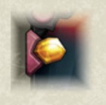

#### VERLÄSST DAS SPIEL

Falls eine Karte im Spiel das Spiel verlässt (z. B. wenn sie auf die Hand 
oder ins Deck zurückgeschickt, zerstört, abgelegt, archiviert oder verbannt 
wird), werden alle Nicht-Æmbermarker und Statuskarten auf der Karte 
entfernt, alle ihre Aufwertungen abgelegt und alle andauernden Effekte, die 
sich auf die Karte auswirken, enden.

Sobald eine Karte von einem Spielbereich in einen Nicht-im-Spiel-Bereich 
verschoben wird, in der die Identität der Karten vor dem Gegner verborgen 
ist (z. B. die Hand, das Deck oder das Archiv eines Spielers), verlieren 
alle ausstehenden Effekte, die derzeit oder in Kürze mit dieser Karte 
interagieren, ihre Wirkung, es sei denn, ein Karteneffekt besagt 
ausdrücklich, dass er mit diesem Bereich interagiert.

Falls eine Kreatur mit Æmber das Spiel verlässt, wird dieses Æmber in den 
Æmber-Vorrat des Gegners zurückgeschickt. Falls eine Nicht-Kreaturen-Karte 
mit Æmber das Spiel verlässt, wird das Æmber in die gemeinsame Reserve 
zurückgeschickt.

Sobald eine Karte das Spiel verlässt, wird sie immer in den entsprechenden 
Nicht-im-Spiel-Bereich ihres Besitzers gelegt, es sei denn, ein 
Karteneffekt besagt ausdrücklich, dass sie mit diesem Bereich interagiert.

Falls Karten während des Abhandelns einer Fähigkeit das Spiel verlassen, 
beziehen sich spätere Anweisungen derselben Fähigkeit auf die Karten, so 
wie sie unmittelbar vor dem Verlassen des Spiels waren.

_**Beispiel**: Der Text von Code-Affe (KW 147) lautet: „**Spielen**: 
Archiviere jede benachbarte Kreatur. Falls jene Kreaturen eine Fraktion 
gemeinsam haben, erhältst du 2AA.“ Falls eine der archivierten Karten von 
einem Effekt betroffen war, der ihre Fraktionszugehörigkeit verändert hat, 
dann bezieht sich der zweite Teil des Effekts von Code-Affe auf die 
Fraktionen, denen die Karten unmittelbar vor dem Archivieren angehört haben._

#### VERSCHIEBEN

Sobald eine Karte dazu anweist, Æmber zu verschieben, wird so viel Æmber 
von einer Karte/einem Ort genommen und auf eine andere Karte bzw. an einen 
anderen Ort verschoben. Dies zählt nicht als das Erbeuten, Stehlen oder 
Verlieren von Æmber.

Sobald eine Karte dazu anweist, Schaden zu verschieben, wird so viel 
Schaden von 1 Karte genommen und auf eine andere Karte gelegt. Diese zweite 
Karte erleidet dadurch keinen Schaden. Deshalb kann der Schaden auch nicht 
von Rüstung oder anderen Effekten, die Schaden verhindern, verhindert werden.

Sobald eine Karte dazu anweist, eine Kreatur zu verschieben, muss diese 
Kreatur unter der Kontrolle des Spielers verbleiben, der sie aktuell 
kontrolliert, sofern die Karte nicht ebenfalls angibt, dass ein anderer 
Spieler die Kontrolle über sie übernimmt. Es ist erlaubt, eine Kreatur so 
zu „verschieben“, dass sie auf ihrer Position in der Schlachtreihe verbleibt.

#### VERWENDEN

Siehe [„Karten verwenden“](#kartenverwenden).

#### VOR

Falls eine Fähigkeit das Wort „vor“ (z. B. **„Vor der Ernte:“** oder **„Vor 
dem Kampf:“**) verwendet, wird die Fähigkeit abgehandelt, bevor der 
Spieleffekt des Erntens oder Kämpfens abgehandelt wird (aber nachdem die 
Karte erschöpft wird, falls dies für das Verwenden der Karte erforderlich 
ist).

#### WIEDERHOLEN

Falls ein Kartentext den Spielern die Anweisung gibt, einen Effekt zu 
wiederholen, wird der gesamte Effekt erneut abgehandelt, einschließlich der 
Wiederholungsanweisung. Falls die Karte, die den Wiederholungseffekt 
hervorruft, aus dem Spiel entfernt wird, kann der Effekt nicht mehr 
wiederholt werden.

**Anm.**: Das Wiederholen eines Effekts ist nicht von der 
[Sechser-Regel](#sechserregel) betroffen, da die Sechser-Regel nur beim 
Spielen oder Verwenden von Karten gilt und nicht beim mehrmaligen Auslösen 
ihrer Effekte.

**Siehe auch**: [Oben genannt](#obengenannt)

#### WÜTEND, WÜTEND MACHEN

Sobald eine Kreatur wütend wird, legt man ein Wütend-Marker auf sie. Sobald 
eine Kreatur mit einem Wütend-Marker auf sich verwendet wird, muss sie zum 
Kämpfen verwendet werden, falls möglich. Nachdem eine Kreatur mit einem 
Wütend-Marker auf sich gekämpft hat, werden alle Wütend-Marker von ihr 
abgelegt.

Solange eine Kreatur einen Wütend-Marker auf sich hat, kann sie nicht 
erneut wütend gemacht werden.

#### X

Manchmal wird die Variable „X“ gebraucht, um einen Wert anzugeben, der 
durch eine Kartenfähigkeit definiert wird. Solange die Variable „X“ nicht 
durch eine Kartenfähigkeit definiert wird, ist ihr Wert gleich 0.

_**Beispiel**: Scharlatan hat Stärke X und die Fähigkeit: „X ist die 
kombinierte Stärke der Nicht-Wechselbalg-Nachbarn von Scharlatan.“ Falls 
dein Gegner nun Schatten von Dis spielt, hat Scharlatan seine Fähigkeit 
nicht mehr und somit Stärke 0._

#### ZENTRUM DER SCHLACHTREIHE

Eine Kreatur ist im Zentrum der Schlachtreihe, sobald sich zur linken und 
rechten Seite dieser Kreatur gleich viele Kreaturen befinden.

Es gibt nur dann ein Zentrum der Schlachtreihe, falls sich in der 
Schlachtreihe eine ungerade Anzahl an Kreaturen befindent. Solange sich 
eine gerade Anzahl an Kreaturen in der Schlachtreihe befindent, gibt es 
kein Zentrum. Falls sich nur eine Kreatur in der Schlachtreihe befindent, 
ist diese Kreatur im Zentrum.

#### ZERSTÖRT
 
Sobald eine Karte durch einen Karteneffekt zerstört wird oder sobald eine 
Karte mindestens so viel Schaden auf sich hat, wie sie Stärke hat, wird sie 
zum Zerstören markiert. Nachdem sie markiert worden ist, werden die 
**„Zerstört:“**-Fähigkeiten jener Karte ausgelöst. Zum Schluss wird die 
markierte Karte auf den Ablagestapel ihres Besitzers gelegt. Falls mehrere 
Karten gleichzeitig zum Zerstören markiert werden, wählt der aktive Spieler 
die Reihenfolge, in welcher die **„Zerstört:“**-Fähigkeiten jener Karten 
abgehandelt werden. Alle markierten Karten werden gleichzeitig auf die 
Ablagestapel ihrer jeweiligen Besitzer gelegt. Der aktive Spieler 
entscheidet, in welcher Reihenfolge diese Karten auf den Ablagestapeln 
ihrer jeweiligen Besitzer angeordnet werden.
 
Ist eine Kreatur zum Zerstören markiert worden, kann nur noch ein 
Ersatzeffekt diese Markierung entfernen, der das Wort „stattdessen“ oder 
„(an)statt“ verwendet. Dadurch wird die Zerstörung der Kreatur ersetzt. Ein 
Effekt, der die markierte Kreatur heilt, entfernt nicht die 
Zerstört-Markierung. Ein Effekt darf die markierte Kreatur in einen anderen 
Nicht-im-Spiel-Bereich (wie auf die Hand oder ins Archiv) verschieben. 
Dennoch gilt die Kreatur in Bezug auf Karteneffekte, immer noch als 
„zerstört“.
 
Falls eine **„Zerstört:“**-Fähigkeit dazu führt, dass noch mehr Karten 
zerstört werden, werden jene Karten auch zum Zerstören markiert und ihre 
**„Zerstört:“**-Effekte werden auch ausgelöst, bevor sie auf den 
Ablagestapel gelegt werden. Keine der zum Zerstören markierten Karten wird 
auf den Ablagestapel ihres jeweiligen Besitzers gelegt, bis alle 
**„Zerstört:“**-Effekte fertig abgehandelt sind.
 
Spieler können keine Kreatur zum Opfern oder Zerstören wählen, die bereits 
zum Zerstören markiert worden sind. Eine Karte, die bereits zum Zerstören 
markiert worden ist, kann nicht erneut zum Zerstören markiert werden und 
jeder Effekt, der versucht eine solche Karte zu opfern oder zu zerstören, 
scheitert. Die **„Zerstört:“**-Fähigkeiten jener Karte können nur ein Mal 
ausgelöst werden.
 
Es können nur die **„Zerstört:“**-Fähigkeiten einer Karte ausgelöst werden, 
die sie zum Zeitpunkt ihrer Markierung hatte. Falls eine Karte nach ihrer 
Markierung eine **„Zerstört:“**-Fähigkeit erhält, wird jene Fähigkeit nicht 
ausgelöst.
 
Geopferte Karten werden ebenfalls zum Zerstören markiert, gelten ebenfalls 
als zerstört und durchlaufen den gleichen oben genannten Prozess der 
Zerstörung.
 
_**Beispiel**: Zwischen 4 anderen Kreaturen hat Daniel einen Archimedes 
(ZdA 108) in seiner Schlachtreihe liegen. Sein Gegner spielt eine Pforte 
nach Dis (RdA 059) und zerstört jede Kreatur. Zuerst werden Daniels 
Kreaturen alle zum Zerstören markiert. Dann werden die 
**„Zerstört:“**-Effekte der Nachbarn von Archimedes ausgelöst, was sie 
beide archiviert. Sofort werden die Lücken in der Schlachtreihe geschlossen 
und Archimedes bekommt zwei neue Nachbarn. Da diese bereits zum Zerstören 
markiert worden sind, können sie keine neue **„Zerstört:“**-Fähigkeit 
erhalten und werden zusammen mit Archimedes auf den Ablagestapel gelegt._
 
_**Beispiel**: Maja hat folgende Kreaturen im Spiel: Jehu der Bürokrat (RdA 
250), Duma die Märtyrerin (RdA 242) mit 2 Schaden auf sich und Feldherr 
Remiel (RdA 241) mit 1 Schaden auf sich. Ihr Gegner spielt eine Giftwelle 
(RdA 280) und fügt jeder Kreatur 2 Schaden zu. Dieser Schaden führt dazu, 
dass Duma die Märtyrerin und Feldherr Remiel zum Zerstören markiert werden. 
Dadurch wird der **„Zerstört:“**-Effekt von Duma die Märtyrerin ausgelöst, 
der Jehu der Bürokrat und Feldherr Remiel heilt. Da Feldherr Remiel bereits 
zum Zerstören markiert ist, wird er dennoch zusammen mit Duma die 
Märtyrerin auf den Ablagestapel gelegt. Jehu der Bürokrat überlebt ohne 
einen Kratzer._
 
_**Beispiel**: Markus hat einen Groggins (ZdA 011) mit einem Phönixherzen 
(RdA 051) im Spiel. Seine Gegnerin Jenny hat ein Staubteufelchen (RdA 083) 
mit einem Seelenwächter (ZdA 083), eine Tranfunzel (RdA 082) und einen 
Schleifer (RdA 095) im Spiel. Markus greift das Staubteufelchen mit seinem 
Groggins an, was dazu führt, dass das Staubteufelchen zum Zerstören 
markiert wird. Die **„Zerstört:“**-Fähigkeit des Staubteufelchens und die 
**„Zerstört:“**-Fähigkeit, die der Seelenwächter dem Staubteufelchen 
gewährt, werden gleichzeitig ausgelöst. Markus entscheidet sich dazu, seine 
Gegnerin zuerst 2 Æmber erhalten zu lassen und dann den Seelenwächter 
auszulösen, der seine stärkste Kreatur – Groggins – zerstört. Sobald 
Groggins zum Zerstören markiert wird, wird der Effekt auf dem angelegten 
Phönixherz ausgelöst. Dadurch wird Groggins auf Markus’ Hand 
zurückgeschickt und jeder anderen Kreatur werden 3 Schaden zugefügt. Dieser 
Schaden markiert nun die Tranfunzel und den Schleifer zum Zerstören. Zum 
Schluss werden alle Kreaturen, die sich noch im Spiel befinden 
(Staubteufelchen, Tranfunzel und Schleifer), auf den Ablagestapel ihrer 
jeweiligen Besitzers gelegt. Die Reihenfolge darf Markus festlegen._
 
#### ZIEHEN-BONUSSYMBOL
 
Siehe [„Bonussymbole“](#bonussymbole).
 

 
#### ZURÜCKSCHICKEN
 
Wird erbeutetes Æmber zurückgeschickt, legt man es in den Æmber-Vorrat des 
Gegners.

# ERRATA

Dieser Abschnitt enthält die offiziellen Errata, die zu einzelnen Karten in 
_KeyForge_ gemacht wurden. Errata überschreiben die gedruckten 
Informationen auf der Karte, für die sie gelten.

**Back-up der Biomatrix (RdA 208)** Der Kartentext sollte lauten: „Diese 
Kreatur erhält: „**Zerstört**: Lege diese Kreatur ins Archiv ihres 
Besitzers.“

**Bauernopfer (RdA 279)** Der Kartentext sollte lauten: „**Spielen**: 
Opfere eine befreundete Kreatur. Falls du das tust, fügst du 2 Kreaturen je 
3{D} zu.“

**Bibliothekszugang (RdA 115)** Der Kartentext sollte lauten: „**Spielen**: 
Für den Rest des Zuges ziehst du immer, wenn du eine andere Karte spielst, 
eine Karte. Verbanne Bibliothekszugang.“

**Experimentelle Therapie (RdA 157)** Der Kartentext sollte lauten: „Diese 
Kreatur darf verwendet werden, als ob sie zur aktiven Fraktion gehören 
würde. **Spielen**: Betäube und erschöpfe diese Kreatur.“

**Köder (RdA 267)** Der Kartentext sollte lauten: „**Spielen**: Falls dein 
Gegner mehr {A} hat als du, stiehlst du 1{A}. Wiederhole den oben genannten 
Effekt, falls dein Gegner immer noch mehr {A} als du hat.“

**Schmerzhafte Ranken (RdA 064)** Der Kartentext sollte lauten: 
„**Spielen**: Füge jeder Kreatur 1{D} zu. Falls dein Gegner in seinem 
letzten Zug einen Schlüssel geschmiedet hat, fügst du stattdessen jeder 
Kreatur 4{D} zu.“

**Back-up der Biomatrix (ZdA 124)** Der Name dieser Logos-Karte sollte 
Sicherheitskopie lauten. **Achtung**: Diese Karte ist nicht identisch mit 
der Mars-Karte **Back-up der Biomatrix (RdA 208)**.

**Doppelte Bruchstelle (ZdA 109)** Der Kartentext sollte lauten: „Alpha. 
**Spielen**: Jeder Spieler erhält {A} in Höhe des {A} in seinem Vorrat.“

**Drummernaut (ZdA 006)** Der Kartentext sollte lauten: 
„**Spielen/Kampf/Ernte**: Schicke eine andere befreundete Riese-Kreatur auf 
deine Hand zurück.“

**Ein Leben für ein Leben (ZdA 273)** Der Kartentext sollte lauten: 
„**Spielen**: Opfere eine Kreatur. Falls du das tust, füge einer Kreatur 
6{D} zu.“

**Elende Puppe (ZdA 107)** Der Kartentext sollte lauten: „**Aktion**: Falls 
ein Verderbensmarker im Spiel ist, zerstöre alle Kreaturen mit 
Verderbensmarker. Andernfalls lege einen Verderbensmarker auf eine Kreatur.“

**Entropischer Wirbel (ZdA 143)** Der Kartentext sollte lauten: 
„**Spielen**: Wähle eine Kreatur. Füge jener Kreatur für jedes Merkmal, das 
sie hat, 2{D} zu und erhalte 1 {A}.“

**Lollop der Titanische (ZdA 014)** Der Kartentext sollte lauten: „Lollop 
der Titanische fügt keinen Schaden zu, sobald er angegriffen wird.“

**Prince Derric der Einiger (ZdA 240)** Der Name dieser Karte sollte 
**Prinz Derric der Einiger** lauten.

**Schatten von Dis (ZdA 103)** Der Kartentext sollte lauten: „**Spielen**: 
Bis zu deinem nächsten Zug gelten die Textkästen feindlicher Kreaturen als 
leer (außer Merkmale).“

**Schmerzreaktion (ZdA 078)** Der Kartentext sollte lauten: „**Spielen**: 
Füge einer feindlichen Kreatur 2{D} zu. Falls dieser Schaden jene Kreatur 
zerstört, füge jedem Nachbarn dieser Kreatur 2{D} zu, nachdem sie das Spiel 
verlassen hat.“

# FREQUENTLY ASKED QUESTIONS

Dieser Abschnitt gibt Antworten auf besonders häufig gestellte Regelfragen. 
Präsentiert werden sie im klassischen FAQ-Format, und sie sind grob in 
Themengebiete unterteilt.

## Alpha

**Kann ich Mimikry (RdA 328) als eine Kopie von Heureka! (ZdA 128) spielen, 
falls ich in diesem Zug bereits eine andere Karte gespielt habe?**

Nein. Falls Mimikry als eine Kopie von Heureka! gespielt wird, besitzt sie 
dadurch auch das Schlüsselwort Alpha. Da du bereits eine andere Karte in 
diesem Zug gespielt hast, ist es dir nicht möglich, in diesem Zug eine 
Alpha-Karte zu spielen. Deshalb wird Mimikry nicht gespielt und geht auf 
deine Hand zurück.

**Kann ich Mimikry (RdA 328) als eine Kopie von Heureka! (ZdA 128) als 
Erstes in Schritt 3 meines Zugs spielen?**

Ja. Mimikry wird als eine Kopie von Heureka! gespielt und besitzt dadurch 
auch das Schlüsselwort Alpha. Da du zuvor noch nichts anderes getan hast 
(eine Karte gespielt, abgelegt oder verwendet hast), kannst du in diesem 
Zug die Alpha-Karte noch spielen.

## „Als ob“

**Ich ernte mit Nexus (RdA 305), was mir erlaubt, ein Artefakt des Gegners 
zu verwenden, „als ob es meines wäre“. Ich entscheide mich für die Scherbe 
des Neids (ZdA 315) meines Gegners. Dieses Artefakt lässt mich „für jede 
befreundete Scherbe“ 1 Æmber erhalten. Die Scherbe des Neids ist die 
einzige Scherbe im Spiel. Wie viel Æmber erhalte ich?**

1 Æmber. Du verwendest die Scherbe des Neids, als ob sie deine wäre. 
Deshalb zählt die Scherbe des Neids im Bezug auf ihre Fähigkeit als 
befreundete Scherbe.

**Ich ernte mit Replikator (RdA 150) und verwende seine Fähigkeit, um den 
Ernte-Effekt auf Sequis (RdA 257) meines Gegners auszulösen, als ob ich ihn 
kontrollieren würde. Aus dem Vorrat welchen Spielers erbeutet Sequis das 
Æmber?**

Sequis erbeutet 1 Æmber aus dem Vorrat deines Gegners. Du verwendest 
Sequis, als ob du ihn kontrollieren würdest. Die Standardregel führt dazu, 
dass Æmber aus dem Vorrat des Gegners erbeutet wird.

## Archiv

**Mein Gegner legt 2 meiner Kreaturen mit der Karte Probensammlung (RdA 
175) in sein Archiv. In meiner nächsten Runde spiele ich die Karte Dysania 
(RdA 141). Was passiert?**

Wenn du Dysania spielst, wird jede archivierte Karte deines Gegners 
abgelegt. Allerdings besagt Probensammlung, dass diese Kreaturen, sobald 
sie das Archiv verlassen, auf die Hand ihres Besitzers genommen werden. 
Deshalb werden die Kreaturen stattdessen auf deine Hand zurückgeschickt. Da 
diese Karten nicht durch den Effekt von Dysania abgelegt wurden, erhältst 
du kein Æmber für die Abhandlung dieses Effekts.

## „Auf diese Weise“

**Wenn ich die Aktion der Obsidian-Schmiede (KW 025) verwende und 
entscheide, eine meiner Kreaturen mit einem Beschützt-Marker zu opfern, 
reduziert diese Kreatur dann die Schmiedekosten?**

Nein. Wenn sie nicht „auf diese Weise zerstört“ wurde, reduziert sie die 
Schmiedekosten nicht.

**Wenn ich die „Universell:“-Fähigkeit von Saurianer-Ei (MM 210) verwende 
und beide aufgedeckten Karten Saurianer-Kreaturen sind, kommen sie dann 
beide ins Spiel? Und erhalten sie beide jeweils drei „+1 Stärke“-Marker?**

Ja und ja. Manche Saurianer-Eier enthalten eben Zwillinge!

## Betäuben

**Ich habe eine betäubte Kreatur in meiner Schlachtreihe, spiele die Karte 
Zorn (RdA 001) und beschließe, ihren Effekt auf diese betäubte Kreatur 
abzuhandeln. Was passiert?**

Falls eine Karte (wie in diesem Fall Zorn) es dir erlaubt, eine Kreatur zu 
verwenden, und falls die Kreatur, die du zu verwenden versuchst, betäubt 
ist, entfernst du die Betäubung, anstatt etwas anderes zu tun. Da Kämpfen 
eine Art ist, eine Kreatur zu verwenden, wird sie erschöpft und die 
Betäubt-Statuskarte entfernt.

Dies funktioniert auch, wenn dein Gegner keine Kreaturen im Spiel hat, denn 
eine Betäubt-Statuskarte zu entfernen ersetzt die normale Verwendung der 
Karte (in diesem Fall Kampf), bevor sie überhaupt beginnt.

**Ich spiele Maaansch (RdA 046), aber jede der Kreaturen meines Gegners ist 
bereits betäubt. Muss ich den Effekt auf Maaansch abhandeln?**

Nein. Du kannst dich trotzdem dafür entscheiden, den **„Spielen:“**-Effekt 
von Maaansch gegen eine der Kreaturen deines Gegners abzuhandeln, dennoch 
kannst du keine Betäubt-Statuskarte auf eine bereits betäubte Kreatur 
legen. Somit passiert nichts.

## Bibliothekszugang

**Ich habe in meinem Zug Logos als aktive Fraktion gewählt und beginne mit 
dem Spielen der Karte Bibliothekszugang (RdA 115), gefolgt von Wildes 
Wurmloch (RdA 125). In welcher Reihenfolge handle ich diese Kombination von 
Effekten ab?**

Wenn du ein Wildes Wurmloch spielst, nachdem du einen Bibliothekszugang 
gespielt hast, passiert Folgendes in nachstehender Reihenfolge:

1. Du erhältst 1 Æmber durch den Æmber-Bonus von Wildes Wurmloch.
2. Die Effekte von Bibliothekszugang und Wildes Wurmloch geschehen 
gleichzeitig, sodass du sie in beliebiger Reihenfolge abhandeln darfst.
3. Du erhältst Æmber durch den Æmber-Bonus von der Karte, die du oben von 
deinem Deck gespielt hast.
4. Gegebenenfalls handelst du die Spielen-Effekte der Karte ab, die du oben 
von deinem Deck gespielt hast. Diese geschehen gleichzeitig mit dem Effekt 
auf Bibliothekszugang. Du darfst sie in beliebiger Reihenfolge abhandeln.

## Bonussymbole

**Wenn ich ein Düsterhorn (MM 040) mit einem Schaden-Bonussymbol spiele, 
fügt sein Schadenssymbol dann 1 zusätzlichen Schaden zu?**

Ja. Kreaturen sind schon im Spiel, bevor ihre Bonussymbole ausgelöst 
werden. In diesem Fall wäre die konstante Fähigkeit des Düsterhorns bereits 
aktiv, bevor du mit seinen Bonussymbolen Schaden zufügst.

**Wenn ich Knochensäge (MM 002) mit einem Schaden-Bonussymbol spiele und 
dieses verwende, um eine befreundete Kreatur zu zerstören, kommt 
Knochensäge dann spielbereit ins Spiel?**

Nein. Da Knochensäge schon im Spiel ist, bevor du seine Bonussymbole 
abhandelst, ist er bereits erschöpft ins Spiel gekommen.

**Wenn ich Wilde Hülle und Fülle (MM 392) spiele, sind mit „Bonussymbole“ 
dann alle Symbole einer Karte gemeint oder nur diejenigen, die durch das 
Schlüsselwort „Verbesserung“ hinzugefügt wurden?**

Es sind alle Symbole gemeint. Selbst die Æmber-Symbole, die immer auf 
deiner Karte auftauchen, gelten als Bonussymbole.

**Wenn ich ein Schulter-Es (MM 257) mit einem Schaden-Bonussymbol spiele, 
zählt das Abhandeln dieses Symbols dann als Schaden, den das Schulter-Es 
zugefügt hat, sprich: Würde mich dieses Symbol stattdessen stehlen lassen?**

Nein. Auch wenn sich das Bonussymbol auf dem Schulter-Es befindet, ist das 
Schulter-Es selbst nicht die Quelle dieses Schadens.

**Wenn ich Echter Fünfziger (MM 255) mit einem Schaden-Bonussymbol spiele 
und zu diesem Zeitpunkt keine anderen Kreaturen im Spiel sind, wird dieser 
Schaden dann Echter Fünfziger zerstören, bevor mich ihr „Spielen:“-Effekt 1 
Æmber stehlen lässt?**

Ja. Sie verlässt das Spiel, bevor ihr **„Spielen:“**-Effekt überhaupt die 
Gelegenheit hatte, ausgelöst zu werden.

**Wenn ich Echter Fünfziger (MM 255) mit einem Schaden-Bonussymbol und 
einem Ziehen-Bonussymbol spiele und zu diesem Zeitpunkt keine anderen 
Kreaturen im Spiel sind, wird dieser Schaden dann Echter Fünfziger 
zerstören, bevor ich ihr Ziehen-Symbol abhandeln kann?** 

Nein. Ihr Ziehen-Symbol wird trotzdem abgehandelt. Ist eine Karte erst 
einmal gespielt, werden alle ihre Bonussymbole abgehandelt, selbst wenn die 
Karte das Spiel verlässt.

**Wenn ich eine Karte mit zwei Schaden-Bonussymbolen spiele und mein Gegner 
eine Kreatur mit Stärke 1 und einem Beschützt-Marker hat, kann ich diese 
Kreatur dann zerstören?**

Ja. Jedes Schaden-Bonussymbol wird separat abgehandelt. Das erste 
Schaden-Bonussymbol kann also den Beschützt-Marker entfernen und das zweite 
kann anschließend die Kreatur beschädigen.

## Erkundung

**Wenn ich Erkundung (MM 316) spiele, was passiert dann mit der Karte, die 
ich ansehe und nicht ablege?**

Du legst sie einfach wieder oben auf dein Deck zurück. Grundsätzlich gilt: 
Wenn du angewiesen wirst, dir eine Karte anzusehen und nichts Weiteres mit 
ihr zu tun, legst du sie genau dorthin zurück, wo sie zuvor war.

## Ersatzeffekte

**Ich spiele die Karte Nervenschock (RdA 276), während mein Gegner 2 Æmber 
in seinem Vorrat hat und eine Kopie von Pos Feen (ZdA 362) kontrolliert. 
Ist es mir möglich, mit dem Effekt von Nervenschock 2 Schaden zuzufügen?**

Ja. Pos Feen hat ein Ersatzeffekt, der den Ort ändert, von wo das Æmber 
gestohlen wird (aus der allgemeinen Reserve statt aus dem Vorrat deines 
Gegners). Dennoch gilt das Æmber als „gestohlen“, wodurch die „Falls du das 
tust“-Bedingung von Nervenschock erfüllt wird.

**Mein Gegner hat Sir Mark (ZdA 223) im Spiel. Falls ich ein 
Dimensionsportal (RdA 108) spiele und dann mit einer Kreatur ernte, 
erbeutet Sir Mark das Æmber von der erntenden Kreatur?**

Nein. In diesem Fall wird der Effekt, durch Ernten Æmber zu erhalten, durch 
das Stehlen von Æmber von deinem Gegner ersetzt. Das bedeutet, dass du das 
Æmber nicht direkt durch das Ernten bekommst. Dadurch ist es Sir Mark nicht 
möglich, es zu stehlen.

**Ich habe eine Kreatur mit der Aufwertung Diskombobulator (KW 149) und 
mein Gegner hat Gargantodon (KW 203). Jetzt versucht mein Gegner, 1 Æmber 
von mir zu stehlen. Was passiert?**

Nichts passiert. Der Diskombobulator besagt, dass dein Æmber nicht 
gestohlen werden kann. Es gibt also nichts, das vom Ersatzeffekt des 
Gargantodon ersetzt werden könnte. Der Stehlen-Effekt deines Gegners 
scheitert.

**Ich habe Pos Feen (ZdA 362) und mein Gegner hat zwei Kopien von Sir Mark 
(ZdA 223). Ich ernte mit Pos Feen. Erbeuten beide Sir Marks Æmber aus der 
allgemeinen Reserve?**

Ja. Jeder Sir Mark sieht das Æmber, das du durch dein Ernten erhältst, und 
versucht es zu erbeuten. Normalerweise würde das nur einem von ihnen 
gelingen, aber da Pos Feen den Erbeutungsversuch durch ein Erbeuten aus der 
allgemeinen Reserve ersetzen, ist dieses spezielle Æmber immer noch da, 
wenn der zweite Sir Mark seinerseits einen Erbeutungsversuch startet. Es 
versuchen also beide Sir Marks, einer nach dem anderen, dasselbe Æmber zu 
erbeuten und jeder Versuch wird durch ein Erbeuten aus der allgemeinen 
Reserve ersetzt.

## Erster Spielzug

**Es ist die erste Runde des Spiels und ich bin Startspieler. Ich wähle 
Logos als aktive Fraktion und spiele die Karte „Phasenverschiebung“ (RdA 
117). Gestattet mir das, trotz der Regel für den ersten Zug (siehe Seite 5) 
eine weitere Karte zu spielen?**

Das Spielen von Phasenverschiebung erlaubt dir, in diesem Zug eine weitere 
Karte von deiner Hand zu spielen, da die Regel für den ersten Zug durch 
Karteneffekte verändert werden kann.

**Es ist die erste Runde des Spiels und ich bin Startspieler. Ich wähle 
Logos als aktive Fraktion und spiele die Karte „Wildes Wurmloch“ (RdA 125). 
Kann der Effekt des Wilden Wurmlochs trotz der Regel für den ersten Zug 
(siehe Seite 5) abgehandelt werden?**

Der Effekt des Wilden Wurmlochs kann abgehandelt werden. Die Regel für den 
ersten Zug besagt, dass nicht mehr als 1 Karte von der Hand gespielt oder 
abgelegt werden kann. Sie verbietet jedoch nicht, dass Karten aus anderen 
Spielbereichen, wie z. B. deinem Deck, gespielt oder abgelegt werden.

## Erwachter Albtraum

**Wenn ich Erwachter Albtraum (MM 017) spiele und anschließend weitere 
Dis-Kreaturen ins Spiel kommen oder das Spiel verlassen, verändern sich 
dann die Schmiedekosten meines Gegners oder werden sie in dem Moment 
festgesetzt, in dem ich Erwachter Albtraum spiele?**

Die Schmiedekosten verändern sich. Es handelt sich um einen andauernden 
Effekt, der stets aktualisiert wird, wenn sich der Spielzustand ändert.

## Faygin

**Ich habe Faygin (RdA 300) im Spiel und mein Gegner hat Straßenkind (RdA 
315) im Spiel. Ich ernte mit Faygin und mit seinem Ernte-Effekt wähle ich 
das Straßenkind meines Gegners. Was passiert?**

Der Effekt von Faygin bewirkt, dass das Straßenkind auf dein Hand geschickt 
werden soll. Sobald eine Karte allerdings das Spiel verlässt, wird sie 
immer in den entsprechenden Nicht-im-Spiel-Bereich ihres Besitzers gelegt 
(siehe „Verlässt das Spiel“ auf Seite 15), es sei denn, die Karte, die sie 
veranlasst das Spiel zu verlassen, besagt etwas anderes. Das Straßenkind 
wird auf die Hand deines Gegners zurückgeschickt statt auf deine Hand.

## Flanken

**Was passiert, wenn ich den Spektralbohrer (RdA 133) bei einer 
Nicht-Flankenkreatur verwende (wodurch sie als Flankenkreatur gilt) und 
dann Positronenblitz (RdA 118) auf sie spiele?** 

Positronenblitz fügt der Kreatur 3 Schaden zu. Dann wählst du 1 Nachbarn 
der Kreatur und fügst ihm 2 Schaden zu und fügst dem anderen Nachbarn der 
zweiten Kreatur 1 Schaden zu.

**Ich habe sowohl Sinestra (MM 047) als auch Dexus (MM 054) draußen, mein 
Gegner hat gar keine Kreaturen im Spiel. Wenn er jetzt seine erste Kreatur 
spielt, verliert er dann 2 Æmber?**

Ja. Die erste Kreatur, die er spielt, befindet sich sowohl an seiner 
rechten als auch an seiner linken Flanke und löst somit beide Fähigkeiten 
aus: die von Dexus und die von Sinestra.

## „Für jede/jedes/jeden“

**Ich spiele die Karte Sack voller Münzen (ZdA 312), während ich 3 Æmber in 
meinem Vorrat habe. Kann ich die 3 Schaden auf mehrere Kreaturen aufteilen?**

Ja. Weil Sack voller Münzen „für jedes“ Æmber in deinem Vorrat 1 Schaden 
zufügt, darf jeder Punkt Schaden einer anderen Kreatur zugewiesen werden.

## Grubenfürst

**Ich habe die Karte Grubenfürst (RdA 093) im Spiel und mein Gegner spielt 
die Karte Restringuntus (RdA 094) und wählt die Fraktion Dis. Was passiert, 
wenn ich versuche, meine Fraktion in meiner nächsten Runde zu wählen?**

Im Schritt „Fraktion wählen“ deines nächsten Zuges bist du in der 
Situation, dass du wegen des Grubenfürsten die Fraktion Dis wählen musst, 
dies aber aufgrund von Restringuntus nicht tun kannst. „Kann nicht“-Effekte 
haben Vorrang vor Muss-Effekten, daher kannst du Dis nicht wählen. (Siehe 
„Kann nicht vs. Muss/Darf“ auf Seite 12.) Du darfst aber trotzdem eine 
deiner anderen Fraktionen wählen.

**Ich haben einen Maverick-Grubenfürst (RdA 093) im Spiel, in einem Deck, 
das nicht die Fraktion Dis hat. Bin ich jetzt gezwungen, Dis als meine 
aktive Fraktion zu wählen?***

Nein. Du kannst eine Fraktion nicht als aktive Fraktion wählen, es sei 
denn, sie befindet sich auf seiner Avatarkarte oder er kontrolliert eine 
Karte, die zu dieser Fraktion gehört. Diese Einschränkung überschreibt den 
Effekt des Grubenfürsten und erlaubt dir, eine deiner Fraktionen als aktive 
Fraktion zu wählen.

## Ketten

**Ich habe 2 Ketten und 7 Handkarten und gehe jetzt zum Schritt „Karten 
ziehen“ über. Werde ich in diesem Schritt eine Kette sprengen?**

Nein, wirst du nicht. Ketten werden nur dann gesprengt, wenn ein Spieler im 
Schritt „Karten ziehen“ auch tatsächlich Karten ziehen würde und dies durch 
Ketten verhindert wird (siehe „Ketten“ auf Seite 8). Da du bereits 7 
Handkarten hast, wirst du keine neuen Karten ziehen und daher auch keine 
Ketten sprengen.

**Ich habe 2 Ketten und 5 Handkarten und gehe jetzt zum Schritt „Karten 
ziehen“ über. Werde ich in diesem Schritt eine Kette sprengen?**

Ja, wirst du. Ketten werden immer dann gesprengt, wenn ein Spieler im 
Schritt „Karten ziehen“ eigentlich Karten ziehen würde, dies aber durch 
Ketten verhindert wird (siehe „Ketten“ auf Seite 8). Da du nur 5 Handkarten 
hast, würdest du normalerweise 1 Karte ziehen, um deine Hand aufzufüllen. 
Allerdings hindern dich deine Ketten am Ziehen dieser Karte. Da du 
normalerweise eine Karte gezogen hättest und dies von einer Kette 
verhindert wurde, sprengst du anschließend 1 Kette.

## Klein Niff

**Ich habe Ronnie Uhrich (ZdA 276) neben Klein Niff (ZdA 289) im Spiel. Ich 
greife mit Ronnie Uhrich eine Kreatur meines Gegners an. Während des 
Kampfes wird er zerstört. Erlaubt mir die Fähigkeit von Klein Niff 1 Æmber 
zu stehlen?**

Ja. Klein Niffs Nachbar muss nicht überleben, damit Klein Niff das Æmber 
stehlen kann.

## Köder

**Mein Gegner hat 14 Æmber in seinem Vorrat und ich habe 0 in meinem. Zu 
Beginn meines Zuges wähle ich die Schatten als aktive Fraktion und spiele 
die Karte Köder (RdA 267). Wie oft wird Köder ausgelöst?**

In dieser Situation wird der Effekt von Köder 2 Mal ausgelöst. Sobald der 
Effekt das erste Mal ausgelöst wird, wird überprüft, ob dein Gegner mehr 
Æmber hat als du. Falls ja, wird der erste Effekt wiederholt. Dadurch wird 
ein weiteres Æmber gestohlen. Da der Kartentext aber angibt, dass nur der 
vorangegangene Effekt wiederholt wird und nicht der gesamte Effekt, kann er 
maximal 2 Mal ausgelöst werden.

## Kreaturen mit Stärke 0

**Ich spiele König der Klippe (RdA 038), während mein Gegner einen 
Plündernden Goblin (RdA 041) im Spiel hat. Was passiert?**

Die Regeln für Schaden besagen: „Hat eine Kreatur mindestens so viele 
Schadensmarker wie Stärke, wird sie zerstört und oben auf den Ablagestapel 
ihres Besitzers gelegt.“ Sobald eine Kreatur eine Stärke von 0 und 0 
Schadensmarker hat, wird sie zerstört.

## Kreaturen verschieben

**Was passiert, wenn ich den Replikator (RdA 150) verwende, um den 
Ernte-Effekt eines gegnerischen Wächter des Sanctums (RdA 256) auszulösen?**

Der Ernte-Effekt vom Wächter des Sanctums bewirkt nichts. Eine Kreatur kann 
nicht von der Schlachtreihe eines Spielers in die Schlachtreihe eines 
anderen Spielers verschoben werden, außer durch Effekte, welche den Wechsel 
der Kontrolle über jene Kreatur ausdrücklich erlauben.

## Kreaturen verwenden

** Ich habe einen erschöpften Haudrauf (RdA 030) im Spiel und mein Gegner 
hat keine Kreaturen in seiner Schlachtreihe. Ich spiele die Karte Zorn (RdA 
001) und entscheide mich dafür, sie auf Haudrauf abzuhandeln. Was passiert?**

Haudrauf wird durch den Effekt von Zorn spielbereit gemacht, aber da es 
keine feindlichen Kreaturen im Spiel gibt, kann er nicht zum Kämpfen 
verwendet werden, also bleibt er spielbereit. Die Kreatur kann dann nach 
den Standardregeln verwendet werden.

**Ich habe Gefechtspheromone (RdA 180), „John Smyth“ (RdA 195) und 
Gedankenmanipulator (RdA 196) im Spiel. Ich opfere Gefechtspheromone und 
ernte mit Gedankenmanipulator, und dann ernte ich mit „John Smyth“ und 
nutze den Ernte-Effekt von „John Smyth“, um Gedankenmanipulator spielbereit 
zu machen. Kann ich Gedankenmanipulator erneut verwenden?**

Ja, Gefechtspheromone gewährt dir in diesem Zug die Verwendung von bis zu 2 
anderen Mars-Karten. Falls du einen Effekt hast, der eine durch 
Gefechtspheromone betroffene Mars-Karte spielbereit macht (z. B. durch 
„John Smyth“), kannst du die Karte erneut verwenden.

## Mimikry-Gel

**Wenn ich Mimikry-Gel (KW 170) spiele und damit eine Kreatur kopiere, die 
Schadensmarker, „+1 Stärke“-Marker, einen Beschützt-Marker oder 
zusätzlichen Text aufgrund einer Aufwertung hat, kopiert das Mimikry-Gel 
dann auch die verschiedenen Marker bzw. den Aufwertungstext?** 

Nein. Das Mimikry-Gel kommt als Kopie der Basiskarte, ohne irgendwelche 
Modifikationen durch andere Effekte, ins Spiel.

**Wenn ich Mimikry-Gel spiele und damit „Bruchpilot“ Muldoon (KW 327) 
kopiere, kommt das Mimikry-Gel dann spielbereit ins Spiel? Und kann ich das 
Schlüsselwort „Stationieren“ verwenden, um das Mimikry-Gel an einer 
beliebigen Position in der Schlachtreihe ins Spiel kommen zu lassen?**

Ja und ja. Das Mimikry-Gel kommt als Kopie der gewählten Karte ins Spiel. 
Sowohl „Stationieren“ als auch die Fähigkeit „kommt spielbereit ins Spiel“ 
treten in Kraft, sowie die Karte ins Spiel kommt. Das Mimikry-Gel wird 
diese Effekte also ebenfalls kopieren.

**Wenn ich Mimikry-Gel spiele und damit einen Legionär-o-bot (KW 214) 
kopiere, der bereits aktiviert wurde und gegenwärtig eine Kreatur ist, zu 
was wird dann das Mimikry-Gel?**

Das Mimikry-Gel wird zu einer Kreatur mit Stärke 5, die verwendet werden 
kann, als ob sie zur aktiven Fraktion gehören würde.

## Neutronenhai

**Mein Gegner hat 2 Kreaturen im Spiel, ich habe keine. Ich spiele 
Neutronenhai (RdA 146) und verwende seinen Spielen-Effekt, um eine 
feindliche Kreatur und den Neutronenhai zu zerstören. Falls die oberste 
Karte meines Decks nicht zur Fraktion Logos gehört, kann ich die Fähigkeit 
vom Neutronenhai dann wiederholen und die andere Kreatur meines Gegners 
zerstören?**

Nein. Das Zerstören vom Neutronenhai und der ersten feindlichen Kreatur 
wird vollständig abgehandelt, bevor mit dem Rest der Fähigkeit vom 
Neutronenhai fortgefahren wird. Weil der Neutronenhai nicht länger im Spiel 
ist, ist seine Spielen/Kampf/Ernte-Fähigkeit nicht weiter aktiv und kann 
nicht erneut ausgelöst werden.

## Phasenverschiebung

**Ich habe die Fraktion Logos als meine aktive Fraktion in diesem Zug 
gewählt und spiele eine Phasenverschiebung (RdA 117) und dann eine weitere 
Kopie von Phasenverschiebung. Wie viele Nicht-Logos-Karten kann ich in 
diesem Zug spielen?**

Du kannst in diesem Zug 2 Nicht-Logos-Karten spielen. Jede Kopie von 
Phasenverschiebung, die du spielst, ermöglicht es dir, eine zusätzliche 
Nicht-Logos-Karte zu spielen.

**Ich wähle Logos als meine aktive Fraktion. Ich spiele Phasen verschiebung 
(RdA 117), dann spiele ich Mimikry (RdA 328) als eine Kopie von Vernebeln 
(RdA 110). Kann ich eine weitere Nicht-Logos-Karte spielen, indem ich den 
Effekt von Phasenverschiebung verwende?**

Nein. Phasenverschiebung erlaubt es dir, 1 Nicht-Logos-Karte in diesem Zug 
zu spielen. Durch das Spielen von Mimikry wird dieser Effekt verbraucht, da 
du ohne den Effekt von Phasenverschiebung Mimikry nicht hättest spielen 
können.

## Rüstung

**Ich habe Schatten-Ich (RdA 310) mit einem Raubritter (RdA 255) als 
Nachbarn. Mein Raubritter wird dann von einer Kreatur mit einer Stärke von 
4 angegriffen. Wie viel Schaden erleidet jede Kreatur in dieser Situation?**

In diesem Fall erleidet Schatten-Ich 2 Schaden, der Raubritter erleidet 
keinen Schaden, und die Kreatur mit der Stärke von 4 erleidet 4 Schaden und 
wird zerstört. Dies geschieht, da die Rüstung des Raubritters 2 Schaden 
verhindert, bevor der Schaden zugefügt werden kann. Wenn der Schaden dann 
tatsächlich zugefügt wird, wird der Schaden, der dem Raubritter zugefügt 
werden würde, stattdessen dem Schatten-Ich zugefügt. Zeitgleich mit dem 
Schaden, der dem Schatten-Ich zugefügt wird, nimmt die Kreatur mit der 
Stärke von 4 durch die Stärke des Raubritters 4 Schaden.

**Ich verwende mein Heiliges Schild (ZdA 218), um meinen Maruck der 
Gezeichnete (ZdA 220) vor Schaden zu schützen. Dann greife ich mit ihm eine 
gegnerische Kreatur mit Stärke von 3 an. Erbeute ich mit Marucks Fähigkeit 
ein Æmber?**

Nein. Schutz-Effekte wie auf Heiliges Schild verhindern den Schaden noch 
vor der Rüstung. Maruck hat nach dem Kampf immer noch 1 Rüstung übrig.

## Schatten von Dis

**Mein Gegner spielt Schatten von Dis (ZdA 103) und zwingt mich, bis zum 
Ende seines nächsten Zugs die Textkästen meiner Kreaturen so zu behandeln, 
als wären sie leer. Ich spiele Silberzahn (RdA 311). Kommt Silberzahn 
spielbereit ins Spiel?**

Ja. Schatten von Dis betrifft nur Kreaturen, solange sie im Spiel sind. 
Silberzahns Fähigkeit modifiziert die Art und Weise, wie er ins Spiel 
kommt, und ist bereits in Kraft getreten, bevor der Effekt von Schatten von 
Dis darauf angewandt wird.

**Mein Gegner spielt Schatten von Dis (ZdA 103). Ich habe 2 Kopien von 
Glimmer (ZdA 323) auf meiner Hand. Darf ich sie beide spielen?**

Nein. Alpha ist eine Spieleinschränkung, die aktiv ist, während die Karte 
mit diesem Schlüsselwort auf meiner Hand ist und bevor die Karte gespielt 
wird. Nachdem du in einem Schritt eine Karte gespielt hast, darfst du keine 
Alpha-Karte mehr spielen.

**Mein Gegner spielt Schatten von Dis (ZdA 103). Ich habe eine 
Dämmerungshexe (ZdA 320) auf meiner Hand. Darf ich die Dämmerungshexe 
spielen und danach noch weitere Karten?**

Ja, du kannst nach dem Spielen von Dämmerungshexe weiter Karten spielen,  
verwenden und ablegen. Omega ist ein Effekt, der nach dem Spielen einer 
Karte in Kraft tritt. Zu diesem Zeitpunkt ist die Dämmerungshexe im Spiel 
und ist vom Effekt von Schatten von Dis betroffen. Dies bedeutet, dass die 
Dämmerungshexe das Schlüsselwort Omega nicht mehr hat.

## Schlüsselhammer

**Mein Gegner schmiedet in seinem Zug 2 Schlüssel. In meinem nächsten Zug 
spiele ich Schlüsselhammer (RdA 066)? Was passiert?**

Schlüsselhammer betrifft nur einen einzigen Schlüssel. Du wählst einen von 
den beiden Schlüsseln, die dein Gegner in seinem letzten Zug geschmiedet 
hat, und machst ihn wieder ungeschmiedet.

## Schulter-Es

**Mein Schulter-Es (MM 257) wird von einer Kreatur mit Rüstung 6 
angegriffen. Stiehlt das Schulter-Es nun 1 Æmber?**

Ja. Die Fähigkeit des Schulter-Es ist ein Ersatzeffekt, der immer dann 
eintritt, wenn das Schulter-Es versuchen würde, Schaden zuzufügen – auch 
dann, wenn ein anderer Karteneffekt diesen Schaden letztlich verhindern 
würde. Dies gilt für Rüstung, Beschützt, Unverwundbar sowie „Kein Schaden 
kann zugefügt werden“-Effekte, beispielsweise auf Schild der Gerechtigkeit 
(RdA 225).

**Mein Schulter-Es (MM 257) wird von einer Kreatur mit Scharmützel 
angegriffen. Stiehlt das Schulter-Es 1 Æmber?**

Nein. In Situationen, in denen das Schulter-Es gar nicht erst versuchen 
würde Schaden zuzufügen, tritt sein Ersatzeffekt nicht ein. Dies gilt, wenn 
es von einer Kreatur mit Scharmützel angegriffen wird, und auch, falls es 
das Schlüsselwort Schwer zu fassen erhalten hat und zum ersten Mal in einem 
Zug angriffen wird.

## Schwer zu fassen

**Wenn ich Gabos Langarm (RdA 086) verwende, um eine Kreatur ohne 
Schlüsselwort Schwer zu fassen anzugreifen, kann ich Gabos Langarms „Vor 
dem Kampf“-Fähigkeit verwenden, um stattdessen einer Kreatur mit dem 
Schlüsselwort Schwer zu fassen Schaden zuzufügen? Oder verhindert das 
Schlüsselwort Schwer zu fassen den Schaden?**

Gabos Langarm kann einer Kreatur mit dem Schlüsselwort Schwer zu fassen 
unter der Verwendung seiner Fähigkeit Schaden zufügen. Die „Schwer zu 
fassen“-Fähigkeit verhindert nur Schaden, sobald die Kreatur angegriffen 
wird. Da Gabos die Kreatur mit dem Schlüsselwort Schwer zu fassen nicht 
direkt angreift, kann ihr Schlüsselwort sie nicht vor dem Schaden schützen.

**Mein Gabos Langarm (RdA 086) greift das Æmberteufelchen (ZdA 053)meines 
Gegners an. Wird Gabos Langarms Schaden durch das Schlüsselwort Schwer zu 
fassen verhindert oder kann ich den Schaden einer anderen Kreatur zufügen?**

Du darfst Gabor Langarms Schaden einer anderen Kreatur zufügen. Das 
Schlüsselwort Schwer zu fassen verhindert nur Schaden, der während eines 
Kampfes der Kreatur mit dem Schlüsselwort Schwer zu fassen zugefügt wird.

## Sechser-Regel

**Falls ich Mimikry (RdA 328) als Kopie einer Aktionskarte im Ablagestapel 
meines Gegners spiele, welche Karte ist von der Sechser-Regel betroffen?**

Im Zusammenhang mit der Sechser-Regel gilt die kopierte Karte als die 
gespielte Karte.

## Sir Mark

**Ich habe 2 Æmber in meinem Vorrat und ich ernte mit einer Kreatur. Mein 
Gegner hat 2 Kopien von Sir Mark (ZdA 223) im Spiel. Erbeuten beide Kopien 
von Sir Mark ein Æmber und wenn ja, woher kommt das zweite Æmber?**

Sir Mark kann nur das 1 Æmbererbeuten, dass gerade geerntet worden ist. Der 
aktive Spieler bestimmt, welcher Sir Mark das Æmber erbeutet.

## So viel wie möglich abhandeln

**Mein Gegner hat eine Kriegsstandarte (RdA 020) im Spiel. Kann ich die 
Karte Poltergeist (RdA 069) spielen, um die Kriegsstandarte zu zerstören, 
auch wenn das Artefakt nicht verwendet werden kann?**

Ja, du kannst den Effekt von Poltergeist auf jedes Artefakt im Spiel 
abhandeln, auch wenn das Artefakt nicht verwendet werden kann. Du handelst 
einfach so viel des Karteneffekts wie möglich ab (siehe „So viel wie 
möglich abhandeln“ auf Seite 7). In dieser Situation wird nur das Artefakt 
zerstört.

**Ich habe keine Kreaturen im Spiel und mein Gegner hat 2 Kreaturen. Kann 
ich die Karte Im Wald verirrt (RdA 327) spielen, obwohl ich keine 2 
Kreaturen im Spiel habe?**

Ja, das kannst du. Die Regel „So viel wie möglich abhandeln“ (auf Seite 7) 
besagt, dass so viel wie möglich von einem Karteneffekt abgehandelt wird 
und jeder Teil einer Karte, den du nicht abhandeln kannst, ignoriert wird. 
Im Kontext von Im Wald verirrt bedeutet das, dass du so viele Kreaturen wie 
möglich mischst. Für den Fall, dass dein Gegner 2 oder mehr Kreaturen in 
seiner Schlachtlinie hat und du keine hast, mischst du also 2 feindliche 
und keine befreundeten Kreaturen in das Deck ihrer Besitzer.

## Timing

**Ich habe Greifranken (RdA 324) unter Masterplan (RdA 288) liegen. Wenn 
ich den „Universell“-Effekt von Masterplan verwende, um Greifranken zu 
spielen, kann ich Masterplan auf meine Hand zurückschicken, bevor die Karte 
geopfert wird?**

Ja. Der Effekt von Masterplan erlaubt dir, die Karte darunter zu spielen, 
bevor Masterplan geopfert wird. Masterplan ist zu dem Zeitpunkt, in dem du 
Greifranken spielst, immer noch im Spiel. Deshalb kann Masterplan durch den 
Effekt auf Greifranken auf deine Hand zurückgeschickt werden.

**Falls eine Karte wie z. B. Pforte nach Dis (RdA 059) mehrere Kreaturen 
zerstört und eine davon Tolas (RdA 103) ist, erhält jemand durch Tolas’ 
Fähigkeit Æmber?**

Nein. Tolas’ Fähigkeit wird erst ausgelöst, sobald die Karten tatsächlich 
auf den Ablagestapel gelegt werden. Zu diesem Zeitpunkt ist Tolas bereits 
zerstört.

**Ich habe Pingel die Nervensäge (RdA 043) im Spiel und mein Gegner spielt 
den König der Klippe (RdA 038). Nimmt der König der Klippe Schaden, bevor 
Pingel zerstört wird?**

Nein. Weil die Fähigkeit vom König der Klippe konstant ist, wird ihr Effekt 
angewandt, solange er im Spiel ist. Dadurch wird Pingel zerstört, bevor 
Pingels „Nachdem eine feindliche Kreatur ins Spiel gekommen ist“-Effekt 
ausgelöst werden kann.

**Ich ernte mit Nexus (RdA 305) und verwende den Spektralbohrer (RdA 133) 
meines Gegners, um Nexus die Fähigkeit „Ernte: Ziehe eine Karte“ zu geben. 
Kann ich dann diese „Ernte:“-Fähigkeit auslösen?**

Ja. Du bist immer noch in dem Zeitfenster, in dem du Nexus’ 
„Ernte:“-Fähigkeiten auslösen kannst. Deshalb kannst du die vom 
Spektralbohrer gewährte Fähigkeit jetzt auslösen.

**Mein Gegner hat 10 Æmber und ist kurz davor seinen zweiten Schlüssel zu 
schmieden. Ich spiele Interdimensionaler Spalt (RdA112). Mein Gegner hat 
Schmiedemeister Og (ZdA 038) im Spiel. Mein Gegner schmiedet in seinem Zug 
für 6 Æmber einen Schlüssel. Was passiert mit den restlichen 4 Æmber?**

Der Effekt von Interdimensionaler Spalt und von Schmiedemeister Og 
passieren zum gleichen Zeitpunkt (nachdem ein Schlüssel geschmiedet worden 
ist), also wählt der aktive Spieler (dein Gegner), welcher Effekt zuerst 
abgehandelt wird.

**Wann wird die Fähigkeit des Schutzanzugs (KW 330) ausgelöst?**

Die Fähigkeit des Schutzanzugs findet statt, nachdem eine Aktionskarte 
gespielt und der Æmber-Bonus abgehandelt worden ist. Dies geschieht zum 
selben Zeitpunkt, an dem andere Effekte stattfinden, „nachdem“ eine 
Aktionskarte gespielt worden ist. Der aktive Spieler muss den Effekt des 
Schutzanzugs aber auslösen, bevor der „Spielen:“-Effekt auf der 
Aktionskarte ausgelöst wird.

**Ich habe ein Sirenen-Horn (MM 212) auf einer Kreatur mit Ansturm 2 und 
greife eine feindliche Kreatur an, die nur noch 2 Lebenspunkte übrig hat. 
Zerstört der Schaden durch Ansturm die feindliche Kreatur, bevor oder 
nachdem ich Æmber auf sie verschieben kann?**

Der durch Ansturm zugefügte Schaden tritt zum selben Zeitpunkt ein wie die 
„Vor dem Kampf:“-Fähigkeiten. Das heißt, der aktive Spieler (in diesem Fall 
du) bestimmt, in welcher Reihenfolge sie abgehandelt werden.

**Ich spiele Schmerzreaktion (ZdA 078) auf eine gegnerische Kreatur und 
zerstöre sie damit. Wann genau wird ihren Nachbarn der Schaden zugefügt? 
Und woher weiß ich überhaupt, wer die Nachbarn der Kreatur sind, wenn sie 
bereits das Spiel verlassen hat?**

Schmerzreaktion ist eine Ausnahme von der Regel, die besagt, dass jeglicher 
Schaden aus einer Fähigkeit gleichzeitig zugefügt wird, da ausdrücklich 
gesagt wird, dass der Schaden zugefügt wird, nachdem die zerstörte Kreatur 
das Spiel verlassen hat. Dieser Schaden wird jeder Kreatur zugefügt, die 
ein Nachbar der zerstörten Kreatur war, unmittelbar bevor diese das Spiel 
verließ.

**Ich verwende Zerschmettern (ZdA 224), um meinen Feuerspeier (RdA 032) 
gegen eine gegnerische Kreatur kämpfen zu lassen, die Stärke 1 hat und über 
zwei Nachbarn verfügt, die auch jeweils Stärke 1 haben. Diese haben jeweils 
einen Nachbarn mit Stärke 2 an den Flanken. Wird mein Zerschmettern die 
Stärke-2-Flankenkreaturen zerstören?**

Nein. Der Schaden von Zerschmettern bezieht sich auf die Nachbarn, welche 
die verteidigende Kreatur unmittelbar vor dem Verlassen des Spiels hatte. 
Da die verteidigende Stärke-1-Kreatur gleichzeitig mit ihren 
Stärke-1-Nachbarn (zerstört durch die „Vor dem Kampf:“-Fähigkeit des 
Feuerspeiers) das Spiel verlässt, wird der Schadenseffekt von Zerschmettern 
scheitern, da die Kreaturen, auf die er sich bezieht, gar nicht mehr im 
Spiel sind.

**Wenn ich Phalanx-Stoß (KW 189) verwende und entscheide, eine befreundete 
Kreatur zu erheben, um den Schadenseffekt zu wiederholen, habe ich dann die 
Möglichkeit, einen Beschützt-Marker von einer Kreatur zu entfernen und 
derselben Kreatur Schaden zuzufügen?**

Ja. Phalanx-Stoß ist eine Ausnahme von der Regel, die besagt, dass 
jeglicher Schaden aus einer Fähigkeit gleichzeitig zugefügt wird, da 
ausdrücklich gesagt wird, dass der Schadenseffekt ein zweites Mal 
wiederholt wird. Dies gibt dir die Möglichkeit, mit der ersten 
Schadensinstanz einen Beschützt-Marker von einer Kreatur zu entfernen und 
dann den wiederholten Effekt zu verwenden, um derselben Kreatur Schaden 
zuzufügen.

**Mein Overlord Graukin (RdA 087) kämpft gegen einen gegnerischen Tolas 
(RdA 103) und zerstört ihn. Wird Tolas‘ Fähigkeit ausgelöst, nachdem ich 
ihn unter meiner Kontrolle ins Spiel gebracht habe?**

Nein. Tolas hat eine konstante Fähigkeit, die nur dann aktiv ist, solange 
er sich im Spiel befindent. Da Tolas zum Zeitpunkt seiner Zerstörung nicht 
im Spiel ist, wird seine konstante Fähigkeit nicht abgehandelt.

## Tödliche Ablenkung

**Ich spiele zwei Kopien von Tödliche Ablenkung (ZdA 305) und wähle jedes 
Mal die gleiche Kreatur. Später in diesem Zug füge ich der Kreatur 1 
Schaden zu. Wie viel Schaden nimmt sie insgesamt?**

Die Kreatur erleidet insgesamt 5 Schaden: 1 durch den Initialschaden, 2 
durch die erste Tödliche Ablenkung, 2 durch die zweite Tödliche Ablenkung. 
Jeder „zusätzliche“ Schaden einer Tödlichen Ablenkung fügt einfach 2 Punkte 
zu der ursprünglichen Schadensinstanz hinzu. Dies ist keine eigene, 
separate Schadensinstanz und löst daher keine weitere Tödliche Ablenkung aus.

## Verlässt das Spiel (Saugfalle)

**Ich kontrolliere eine Saugfalle (RdA 132), die meinen eigenen 
Kelifi-Drachen (RdA 037) verbannt hat. Die Saugfalle wird durch Greifranken 
(RdA 324) auf die Hand ihres Besitzers zurückgeschickt, ich habe aber kein 
Æmber. Bekomme ich meinen Kelifi-Drachen zurück?**

Ja. Der Kelifi-Drache wird nicht gespielt, wenn er von der Sprengfalle 
zurückgeschickt wird, sondern wird ins Spiel gebracht. Wird eine Karte ins 
Spiel gebracht, umgeht das die normalen Spielbeschränkungen, d. h., der 
Kelifi-Drache wird wieder ins Spiel gebracht, egal wie viel Æmber du hast.

**Ein Mürrischer Caper (ZdA 313), den ich besitze, den aber mein Gegner 
kontrolliert, wird mit einer Saugfalle (RdA 132) verbannt. Später wird die 
Saugfalle zerstört. Welcher Spieler hat die Kontrolle über den Mürrischen 
Caper, sobald er ins Spiel zurückgeschickt wird?**

Sobald die Saugfalle den Mürrischen Caper ins Spiel zurückschickt, gilt er, 
als würde er erneut „ins Spiel kommen“. Die Fähigkeit des Mürrischen Capers 
führt erneut dazu, dass er unter der Kontrolle deines Gegners ins Spiel 
kommt.

## Wildes Wurmloch; Kelifi-Drache

**Ich habe 0 Æmber in meinem Æmber-Vorrat und habe die Fraktion Logos als 
meine aktive Fraktion gewählt. Ich spiele Wildes Wurmloch (RdA 125) und 
versuche, die oberste Karte meines Decks, Kelifi-Drache (RdA 037), zu 
spielen. Was passiert?**

Der Kelifi-Drache wird wieder oben auf das Deck zurückgelegt. Der 
Kelifi-Drache hat eine Spielbedingung, nämlich 7 Æmber in deinem 
Æmber-Vorrat zu haben, und da du anfangs keines hattest (du hast jetzt 1 
durch das Spielen des Wilden Wurmlochs), hast du nicht genug, um den 
Kelifi-Drachen spielen zu können. Da du die Karte nicht spielen kannst, 
wird sie an den Ort zurückgelegt, von dem aus du versucht hast sie zu 
spielen, in diesem Fall oben auf das Deck.

## Wühler

**Was passiert, wenn zwei Wühler (MM 006) benachbart sind und ich einen von 
ihnen mit meiner Stärke-2-Kreatur bekämpfe?**

Beide Wühler nehmen gleichzeitig 2 Schaden. Da der Schaden nur ein Mal 
zugefügt wird, löst dies keine weiteren Schadensinstanzen aus.

## \[ZENSIERT\]

**Wenn ich über eine andere Methode als seine eigene Fähigkeit ein viertes 
Æmber auf \[ZENSIERT\] (ZdA 139) lege, kann ich es dann sofort opfern und 
einen Schlüssel schmieden?**

Nein. \[ZENSIERT\] hat nur eine einzelne Fähigkeit. Sie wird ausgelöst, 
nachdem du Logos als deine aktive Fraktion gewählt hast, und bewirkt, dass 
1 Æmber auf die Karte gelegt wird und du anschließend die Möglichkeit hast, 
die Karte zu opfern und einen Schlüssel zu schmieden, falls mindestens 4 
Æmber darauf liegen. Es ist nicht möglich, einen Bestandteil der Fähigkeit 
(„schmiede kostenlos einen Schlüssel“) losgelöst von den anderen zu 
verwenden.

## „Zerstört:“-Effekte

**Im Zug meines Gegners verwendet er Yxilo-Schütze (RdA 204), um zu ernten 
und seinen Ernte-Effekt auf meinen Falscher Fünfziger (RdA 296) 
abzuhandeln. Wird Falscher Fünfziger verbannt oder landet er wieder auf 
meiner Hand?**

Falscher Fünfziger geht zurück auf deine Hand. „Zerstört:“-Effekte (siehe 
„Zerstört“ auf Seite 16) passieren unmittelbar vor der Zerstörung einer 
Kreatur, was bedeutet, dass Falscher Fünfziger wieder auf die Hand seines 
Besitzers geschickt wird, bevor der Yxilo-Schütze versuchen kann, ihn mit 
seinem Ernte-Effekt zu verbannen. Zu diesem Zeitpunkt sind alle noch 
offenen Effekte, die darauf warten, auf Falscher Fünfziger abgehandelt zu 
werden, nicht mehr vorhanden. Falscher Fünfziger wird in einen 
Nicht-im-Spiel-Bereich verschoben, in dem die Identität der Karten vor dem 
Gegner verborgen ist (siehe „Verlässt das Spiel“ auf Seite 15).

**Ich habe einen Seelendieb (RdA 098) im Spiel und mein Gegner hat einen 
Valdr (RdA 029). Ich verwende meinen Seelendieb, um Valdr anzugreifen und 
beide Kreaturen werden zerstört. Wird die Fähigkeit von Seelendieb 
ausgelöst?**

Nein, die Fähigkeit von Seelendieb wird nicht ausgelöst. Damit der 
Seelendieb seine Fähigkeit auslösen kann, muss er im Spiel sein. Wenn also 
sowohl der Seelendieb als auch die Kreatur, gegen die er kämpft, sterben, 
sterben sie gleichzeitig und die Fähigkeit von Seelendieb kann nicht 
ausgelöst werden (siehe „Zerstört“ auf Seite 16).

**Falls Duma die Märtyrerin (RdA 242) und eine andere meiner Kreaturen 
beide durch einen Schadenseffekt wie den von Giftwelle (RdA 280) zerstört 
werden, kann Duma die Märtyrerin meine andere Kreatur vor ihrer Zerstörung 
retten?**

Nein. Der Schaden von Giftwelle führt dazu, dass Duma die Märtyrerin und 
deine andere Kreatur zum Zerstören markiert werden. Danach kann die Heilung 
der Kreatur ihre Zerstörung nicht verhindern. 

**Ich habe Tolas (RdA 103) im Spiel. Wenn mein Falscher Fünfziger (RdA 296) 
zerstört wird, erhalte ich auch Æmber, falls der Falsche Fünfziger auf 
meine Hand kommt statt auf meinen Ablagestapel?**

Ja. Eine Karte gilt immer noch als zerstört, auch wenn ihr 
„Zerstört:“-Effekt sie aus dem Spiel verschiebt.

**Falls mein Jargoggle (ZdA 131) in meinem Zug zerstört wird und seine 
„Zerstört:“-Fähigkeit lässt mich eine Karte mit dem Schlüsselwort Omega 
spielen, kann ich danach noch eine Karte spielen?**

Normalerweise nicht. Falls Jargoggle in deinem Schritt 3 zerstört wird, 
darfst du keine weiteren Karten spielen oder verwenden – nach dem 
Abschließen aller ausgelösten Effekte geht es mit dem nächsten Schritt 
weiter. Falls Jargoggle aber in deinem Schritt 1 zerstört wird, weil du 
z.B. einen Schlüssel geschmiedet hast, während ein Verrücktes Dingsbums (RdA 
134) im Spiel war, machst du einfach mit Schritt 2 weiter, wo du deine 
Fraktion wählen darfst und dann mit Schritt 3 weitermachst, in dem du ganz 
normal Karten spielen und verwenden kannst.

**Ich habe eine Kreatur mit einer Stärke von 2, an der Seelenwächter (ZdA 
083) angelegt ist, im Spiel und meine Gegner hat eine Kreatur mit einer 
Stärke von 6 und eine Kreatur mit einer Stärke von 5 im Spiel. Sterben 
beide gegnerischen Kreaturen oder nur die Kreatur mit der Stärke von 6, 
sobald ich einen Opal-Ritter (ZdA 260) spiele?**

Nur die Kreatur mit der Stärke von 6. Da der Effekt von Seelenwächter 
ausgelöst wird, bevor die zerstörten Kreaturen tatsächlich das Spiel 
verlassen haben, wird die Kreatur mit der Stärke von 6 als Ziel anvisiert, 
auch wenn die Kreatur zuvor schon zum Zerstören markiert worden ist.

**Ich habe einen Optio Gorkus (MM 226) im Spiel, an den ein Imperialer 
Schild (KW 185) angelegt ist. Dann spiele ich eine Karte, die alle 
Kreaturen zerstört. Kann ich den „Zerstört:“-Effekt der Nachbarn von Optio 
Gorkus verwenden, um alles Æmber von ihnen auf Optio Gorkus zu verschieben, 
bevor ich den vom Imperialen Schild gewährten „Zerstört:“-Effekt verwende, 
um das ganze Æmber in die allgemeine Reserve zu verschieben, damit es 
meinem Gegner nicht in die Hände fällt?**

Ja. Der aktive Spieler bestimmt die Reihenfolge der „Zerstört:“-Effekte. 
Wenn die Kreaturen in deinem Zug zerstört werden, kannst du das Æmber von 
deinen zerstörten Kreaturen in die allgemeine Reserve verschieben. Werden 
die Kreaturen jedoch im Zug deines Gegners zerstört, könnte dieser die 
umgekehrte Reihenfolge festlegen, um sich das Æmber der zerstörten 
Kreaturen anzueignen.

